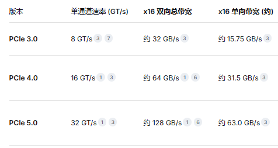

# 总线是什么

显卡和 CPU 之间的专用数据高速公路，这条公路的作用，就是把 CPU 发出的所有图形指令和画面数据，用最快的速度运给显卡去处理。

USB 全称就叫做通用串行总线

之前一直是同步并行，现代是串行并行

- 同步并行需要照顾数据的协同传输，导致速度不会很快，而串行并行每个队列排排站就好，自己管自己的，提升了速度。
- 同步并行会有相互之间的数据干扰，还需要加强抗干扰的能力，出现错误重传代价大
- 同步并行的线宽，针脚多，接口大

# PCI 总线

早期不同的设备所使用的总线接口是完全不一样的，声卡用着声卡的接口，网卡用着网卡的接口，显卡用着显卡的接口，而且最要命的是，不同品牌的接口还不一样，这样的情况就造成了很多的局限性。

当时业内的电脑巨头 IBM 就联合 intel 为他们的 PC/AT 制定了接口的标准，ISA 总线

最终统一天下的是 PCI 总线

# PCI-E

PCIe 有两个存在形态，一个是接口，一个是通道

## 接口

可以插 PCIe 接口的显卡、固态硬盘、网卡、声卡、PCIE 转 USB 转接口等等

## 通道

M.2 固态硬盘，这时候接口形状是 M.2，PCIe 在这里就承担数据传输总线的作用了

## 带宽分配

PCIe 总线的带宽是按长度计算的（就是实际的物理长度），最短的是 PCIe X1，然后是 PCIe X2，PCIe X4P，CIe X8，最长的就是 PCIe X16

任何 X16 的设备都可以插在尾部非闭合的 X1 槽中运行，只不过这个设备肯定是没法发挥全部的性能了。你也可以把 X1 的设备插在 X16 的槽中运行，只不过这样就会浪费带宽了。

## 版本

对于 RTX 5060 这块 pcie 5.0 x8通道来说，如果cpu 是支持 pcie3.0 x16 单卡 和 pcie3.0 x8 双卡的，性能差别会很大么？ 