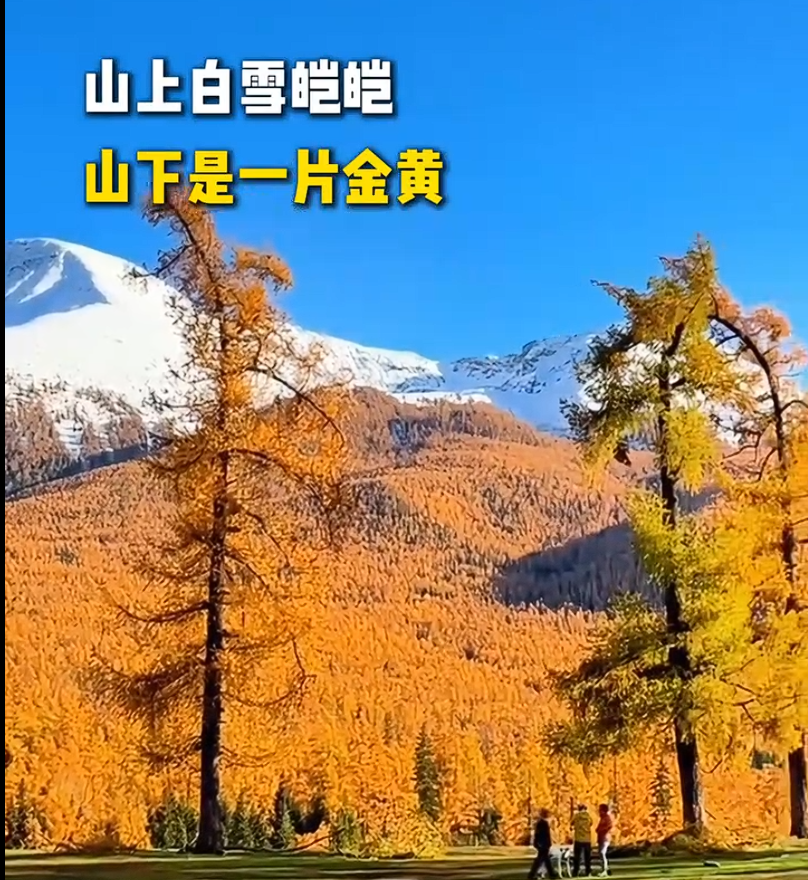
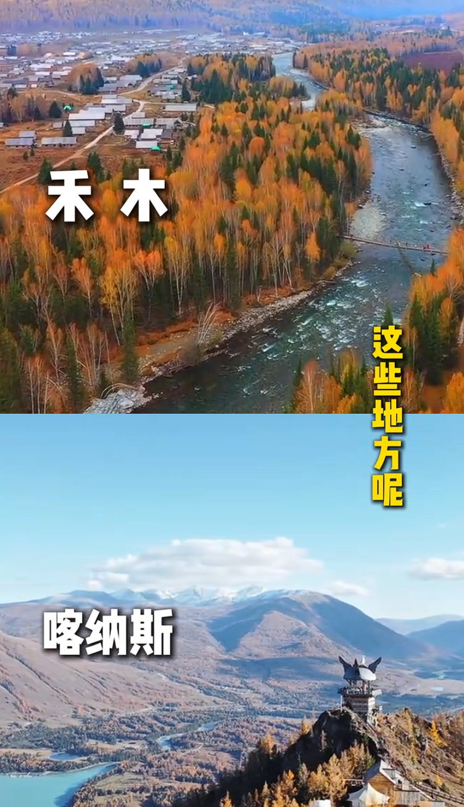
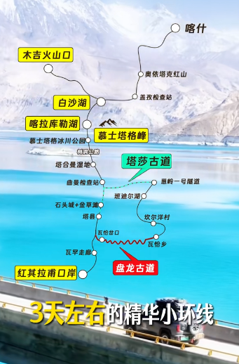
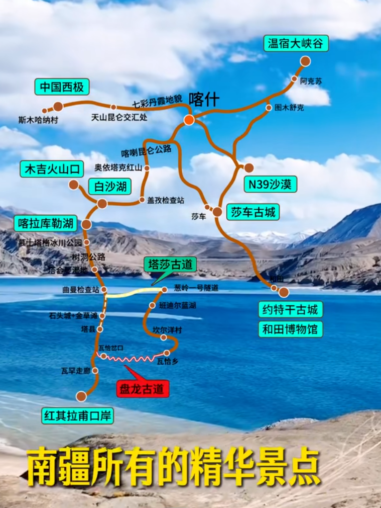
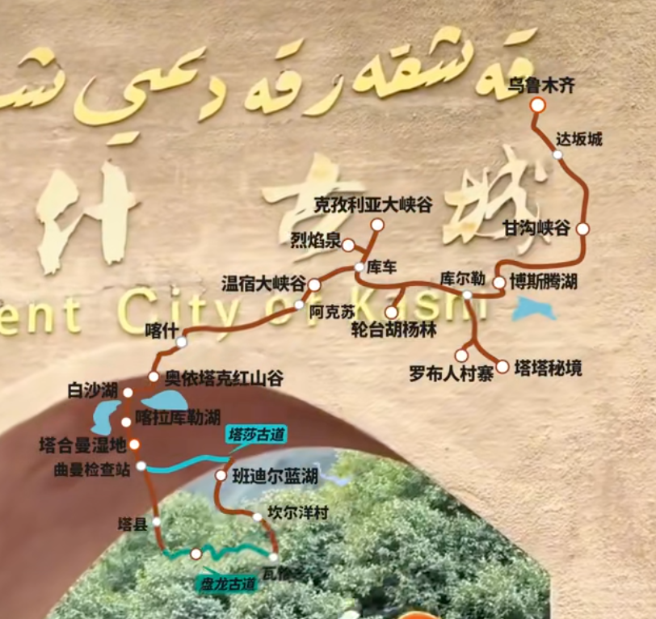

北疆阿勒泰的深秋

十月一假期结束，独库公路就要关闭了

禾木和喀纳斯

还是 11 月之后下雪了 北疆比较好

南疆 沙漠和戈壁

4 ~ 6 月风沙比较大

7、8 月的温度比较高

10 月温度最舒适 也很少下雨 也正是看胡杨的季节 金色的胡杨 配上 蓝天白云，羊肉好吃，阿克苏的苹果，库尔勒的香梨，喀什伽师的西梅，阿图什的无花果，和田皮亚曼的石榴

探索震撼心灵的帕米尔高原

乌鲁木齐一路南下到喀什

被称为胡杨活化石的塔台塔里木胡杨林

女儿国

穿越死亡之海的塔克拉玛干沙漠公路

到美食遍野的和田

感受异域风情的喀什

打卡帕米尔高原的白沙湖

木吉火山口

穆斯塔格雪山

盘龙古道

喀什古城等精华景点

还可以打卡沙漠公路 塔克拉玛干沙漠和田约特干古城 温宿大峡谷 西极村 

沿途依次达卡罗布人村寨 塔克拉玛干沙漠 胡杨林 温树大峡谷  喀什古城 帕米尔高原等景点 全程呢不走回头路

 
那从乌鲁木齐出发  我们可以往下走  到达我们的库尔勒 在库尔勒呢这里有一个博斯腾湖  非常值得大家一看  大家可以在这里喂喂海鸥  也是新疆最像海的一个地方

我们从库尔勒往下就会到达轮台  这个地方最出名的就是轮台塔里木胡杨林

再往下呢我们就会经过库车沙雅 可以再去看沙雅的胡杨林

那如果不想去的话，直接往下到达阿克苏 最主要的就是去看一下温宿大峡谷

我们再往下到达喀什

第一天：出发地-乌鲁木齐【四钻】
第二天：乌鲁木齐-乌尉高速-天山胜利隧道-罗布人村寨-库尔勒【四钻】
第三天：库尔勒-自驾克孜利亚大峡谷-库车老城-热斯坦街-门巴扎-龟兹小巷-库车大馕城-龟兹乐舞（开放安排）-库车【四钻】
第四天：库车-烈焰泉-温宿大峡谷-阿克苏【四钻】
第五天: 阿克苏-喀什古城-高台民居（拱门打卡-蓝窗土墙 -光影巷子）-漫游喀什古城-西域公主旅拍-喀什【四钻】
第六天：喀什-中巴友谊雪山公路-白沙湖北岸+南岸-慕士塔格冰川公园4号冰川-塔吉克族家访（塔吉克族特色奶茶糕点-牦牛酸奶-安排换装秀-民族服饰拍照-学跳塔吉克族特色鹰舞-鹰笛表演）-塔吉克族婚礼体验-塔县【含氧房】
第七天：塔县-托格伦夏村日出-盘龙古道-坎儿洋乡-班迪尔湖-帕米尔之眼-喀拉库里湖-喀什【四钻】
第八天：喀什-出发地

第一天：出发地-乌鲁木齐【四钻】
第二天：乌鲁木齐-天池-可可托海/富蕴【舒适】
第三天：可可托海/富蕴-可可托海景区-331千里画廊（开放安排）-阿勒泰【四钻】
第四天：阿勒泰-阿禾公路-途观乌希里克-通巴森林-托勒海特大草原-禾木轻摄影旅拍-篝火晚会-禾木【景区住宿】
第五天：禾木-禾木晨曦日出-白桦林-喀纳斯湖-湖边漫步-喀纳斯【景区住宿】
第六天:  喀纳斯-喀纳斯三湾（神仙湾-月亮湾-卧龙湾）-百里油田-克拉玛依 【四钻】
第七天：克拉玛依-自驾360度环湖赛里木湖-日落火锅-日落轰趴-音乐会-赛里木湖露营【湖畔露营】
第八天：赛里木湖-湖边漫步-乌鲁木齐【四钻】
第九天：乌鲁木齐-出发地
营地关闭后（大概9月10日左右）
第七天：克拉玛依-自驾360度环湖赛里木湖-日落火锅-日落轰趴-音乐会-赛里木湖东门
第八天：二进赛里木湖-湖边漫步-乌鲁木齐【舒适】
第九天：乌鲁木齐-出发地

阿禾公路能随意停车不

