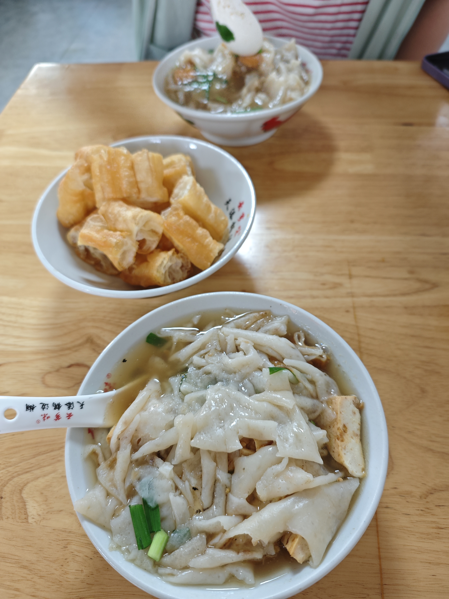
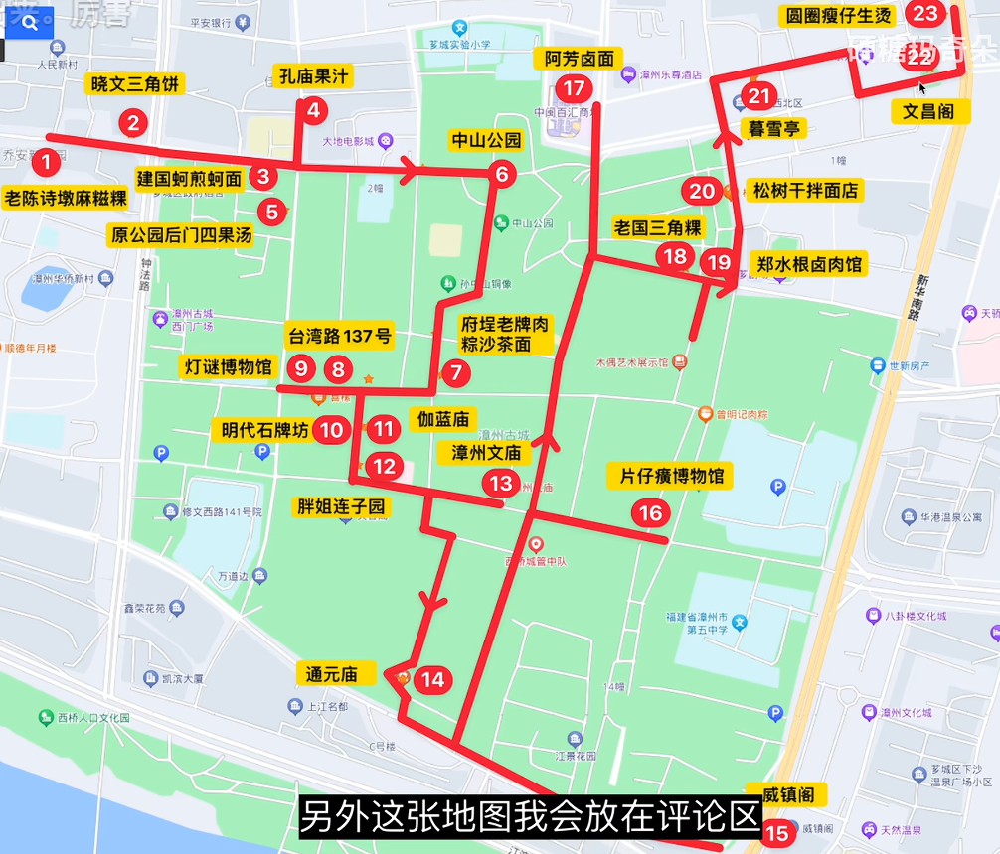

- [锅边糊](#锅边糊)
  - [天添锅边糊](#天添锅边糊)
  - [漳州古城的青年路锅边糊](#漳州古城的青年路锅边糊)
- [面煎粿](#面煎粿)
  - [漳州古城的老康祖传面煎粿](#漳州古城的老康祖传面煎粿)
  - [漳州古城的阿国面煎粿](#漳州古城的阿国面煎粿)
  - [漳州古城的老国三角粿](#漳州古城的老国三角粿)
  - [漳州古城的麻糍顺](#漳州古城的麻糍顺)
- [豆花](#豆花)
  - [漳州古城的阿君豆花](#漳州古城的阿君豆花)
  - [漳州古城附近的东华豆花](#漳州古城附近的东华豆花)
  - [漳州古城附近的丽琴豆花](#漳州古城附近的丽琴豆花)
- [四果汤](#四果汤)
  - [小洪四果汤](#小洪四果汤)
- [盐酥鸡](#盐酥鸡)
  - [阿里山](#阿里山)
- [蚵煎蚵面](#蚵煎蚵面)
  - [建国蚵煎蚵面](#建国蚵煎蚵面)
- [参考路线](#参考路线)

# 锅边糊

## 天添锅边糊

糊糊很有味道，哪个料都比较好吃

## 漳州古城的青年路锅边糊

人多位置少，仅仅上午营业

# 面煎粿

稍微期待，很期待麻糍顺

## 漳州古城的老康祖传面煎粿

## 漳州古城的阿国面煎粿

## 漳州古城的老国三角粿

## 漳州古城的麻糍顺

# 豆花

## 漳州古城的阿君豆花

不看好

## 漳州古城附近的东华豆花

据说长龙

## 漳州古城附近的丽琴豆花

据说便宜

# 四果汤

漳州是四果汤发源地

## 小洪四果汤

# 盐酥鸡

## 阿里山

# 蚵煎蚵面

## 建国蚵煎蚵面

# 参考路线

