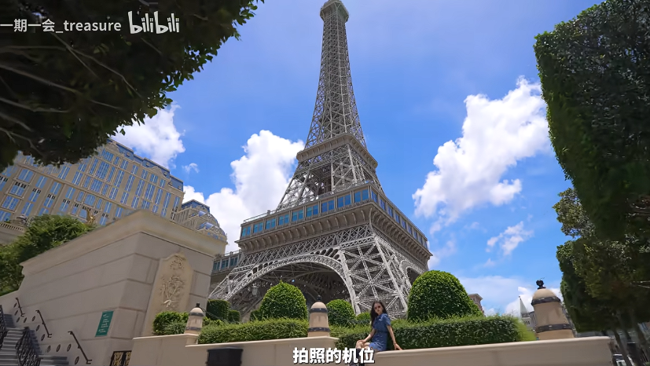

14:30   官也街

15:00   土生葡人之家

15:20   威尼斯人

16:30   巴黎人

17:00   新濠影汇

18:00   伦敦人

18:30   美狮美高梅  

19:00   永利皇宫 

20：00  轻轨看澳门夜景。 氹仔线从永利皇宫到排角

20：30  澳门银河酒店

21：00  烟花表演

- [官也街](#官也街)
  - [历史沿革](#历史沿革)
  - [设施](#设施)
  - [文化](#文化)
    - [路名由来](#路名由来)
    - [周边建筑](#周边建筑)
    - [文娱活动](#文娱活动)
  - [一句话总结](#一句话总结)
- [龙环葡韵湿地](#龙环葡韵湿地)
- [威尼斯人，巴黎人，伦敦人 开卡详情](#威尼斯人巴黎人伦敦人-开卡详情)
- [威尼斯人](#威尼斯人)
  - [一句话总结](#一句话总结-1)
- [巴黎人](#巴黎人)
- [新濠影汇](#新濠影汇)
- [伦敦人](#伦敦人)
- [美狮美高梅](#美狮美高梅)
- [永利皇宫](#永利皇宫)
- [澳门银河酒店](#澳门银河酒店)

# 官也街

官也街（Rua do Cunha），位于中国澳门特别行政区嘉模堂区境内，是氹仔旧城区的重要组成街道之一。
官也街于1884年正式命名；于19世纪时建有街市；于1983年5月1日被海岛市市政划为澳门第一个行人专用区；于2003年改建设有广场。
官也街南起施督宪正街、告利雅施利华街，北至地堡街、消防局前地；全长121米，宽5米。

## 历史沿革

1884年，官也街已正式命名。
19世纪时，官也街建有街市。
1983年5月1日，官也街被海岛市市政划为澳门第一个行人专用区。
2003年，官也街街市撤出，改建为广场供市民及有空休息使用。
2010年11月14日，时任中华人民共和国国务院总理温家宝来到官也街，视察市场供应和物价情况。
2016年10月11日下午，时任中华人民共和国国务院总理李克强在时任中华人民共和国澳门特别行政区行政长官崔世安陪同下，在澳门视察。李克强在澳门官也街同市民和游客亲切互动。
2024年，官也街首次启用临时行人专用区。

## 设施

免费WIFI

卫生间

自动售邮票机

资讯二维码

## 文化

### 路名由来

官也是澳门第81任总督佩德罗·亚历山德里诺·达·库尼亚（Pedro Alexandrino da Cunha）的名字。他是一位葡萄牙海军上校，1850年5月28日抵达澳门出任总督，在同年7月6日因患上霍乱而病逝，终年49岁

### 周边建筑

官也街呈现出最典型的三种地中海色彩搭配：蓝与白、金黄与蓝紫、土黄与红褐，两旁楼房约有四十幢，大多是两层高矮屋，店铺较为集中，可以说是往昔氹仔的商业中心。店号多是食店、手信店，此外还有杂货店、药店。

### 文娱活动

2009年的电影《游龙戏凤》曾在官也街取景

氹仔市集

哪咤诞：民间信俗（澳门哪吒信俗）是澳门具特色的传统礼俗之一，被列入国家级非遗项目名录及澳门非物质文化遗产清单。每年农历五月十八的哪咤诞都会举行贺诞仪式，纪念这位儿童守护神。“哪咤太子出巡”便是其中一项重点贺诞活动，哪咤太子会在金龙护法、仙女散花等护送下前往议事亭前地供善信参拜。2024年6月23日，哪咤太子出巡暨醒狮采青路线途经官也街

## 一句话总结

自动售邮票机，100多米的小吃街，可以填饱肚子。晚上人很多建议中午在这儿吃。（旺记咖啡）

# 龙环葡韵湿地

龙环葡韵湿地 葡人之家

绿白配色，方形屋顶。

有个万象书店，里面的纪念品还挺漂亮的

龙环葡韵公园湖畔边 自动扶道把你送到威尼斯人

# 威尼斯人，巴黎人，伦敦人 开卡详情

三家无论在哪里开卡都是一样的，会送一些餐饮购物券，大概就是100元或者50元的代金券，聊胜于无吧，没啥用，额外再送你一张100元的筹码，但是只有投入500以上才能玩，不太适合白嫖

# 威尼斯人

澳门仿制

威尼斯总督府：又称威尼斯公爵府，始建于 9 世纪，是欧洲中世纪哥特建筑，因与伊斯兰国家的文化贸易往来，其立面的席纹图案受伊斯兰建筑影响。它曾是威尼斯共和国的政府办公楼，现在是艺术博物馆。总督府建筑风格独特，巨型上层建筑建在轻盈精巧的镂花拱顶上，内部有许多著名景点，如 “纸门”“大国会厅”“十人会议” 厅等，还收藏有众多古董铭文和雕塑作品，1998 年被联合国教科文组织列为世界遗产。

叹息桥：建于 1600-1603 年，是一座早期巴洛克式风格的密封式拱桥，由白色石灰岩铸成。桥两端连接着总督府和威尼斯监狱，是古代由法院向监狱押送死囚的必经之路。死囚在总督府接受审判后，经过这座密不透气的桥时，只能透过小窗看见蓝天，从此失去自由，会不由自主地发出叹息之声，因此得名。不过，现在因电影《情定日落桥》等影响，叹息桥也成为了浪漫的象征，传说恋人们在桥下接吻就可以天长地久。

圣马可钟楼：位于威尼斯的圣马可广场，是广场上最高的建筑，高 99 米，也是威尼斯的城市坐标之一。每到整点时，塔顶的五钟齐鸣。登顶钟楼可以俯瞰水城威尼斯的全貌及美丽的澙湖风光，还能眺望远处的阿尔卑斯山，同时也是拍摄安康圣母教堂全貌的最佳地点之一。

黄金宫：始建于 1440 年，位于大运河岸边，由威尼斯最有影响力的贵族家族之一 —— 孔塔里尼家族兴建。因其外墙曾用金箔装饰、或漆上鲜艳的群青颜料，在阳光下闪闪发光，故而得名。它是现存最伟大的威尼斯哥特式建筑作品之一，现在是一座收藏中世纪绘画和雕塑的博物馆，馆内收藏了威尼斯画派从 14 世纪到 18 世纪的绘画珍品。

## 一句话总结

威尼斯二楼，假的天空，伪造的威尼斯建筑。可以说是相当牛逼了。

# 巴黎人

从六楼出来，有个观景台可以看

巴黎铁塔下的爱情（贵就不说了，据说全是人妖）

19：30 - 23：30 每 15 分钟一次灯光秀

# 新濠影汇

大商场哦，里面大VR游乐场哦

8字摩天轮，扫描二维码，注册会员会便宜些。

开卡赠送20也没啥意思

# 伦敦人

电话亭  这个里面也有安德鲁蛋挞

里面有小景观

20：30 - 23：30 每 30 分钟一次灯光秀

皇家卫兵换岗秀(周一休息)
周二-周四 19:30、21:30  
周五-周日 16:30、19:30、21:30

# 美狮美高梅

免费的奶茶和蛋挞

黑狮珍珠鲜奶，金狮珍珠奶茶 

13:00   15:00   17:00  19:00  

飞鱼表演，有说整点开始的，有说只有这四个时间有的

# 永利皇宫

门口是有缆车的，大家一定要去酒店二楼排队，千万不要去户外那个站点，排二楼的人要少，坐缆车上看看音乐喷泉，太美了。而且大家如果是住在永利皇宫酒店，或者已经前面注册了人类的会员，是可以获得优先排队权的

# 澳门银河酒店

银河酒店的大厅，每天上午十点开始，每半个小时就有一次超巨大的钻石表演。

10:00-22:00 每30分钟/场
