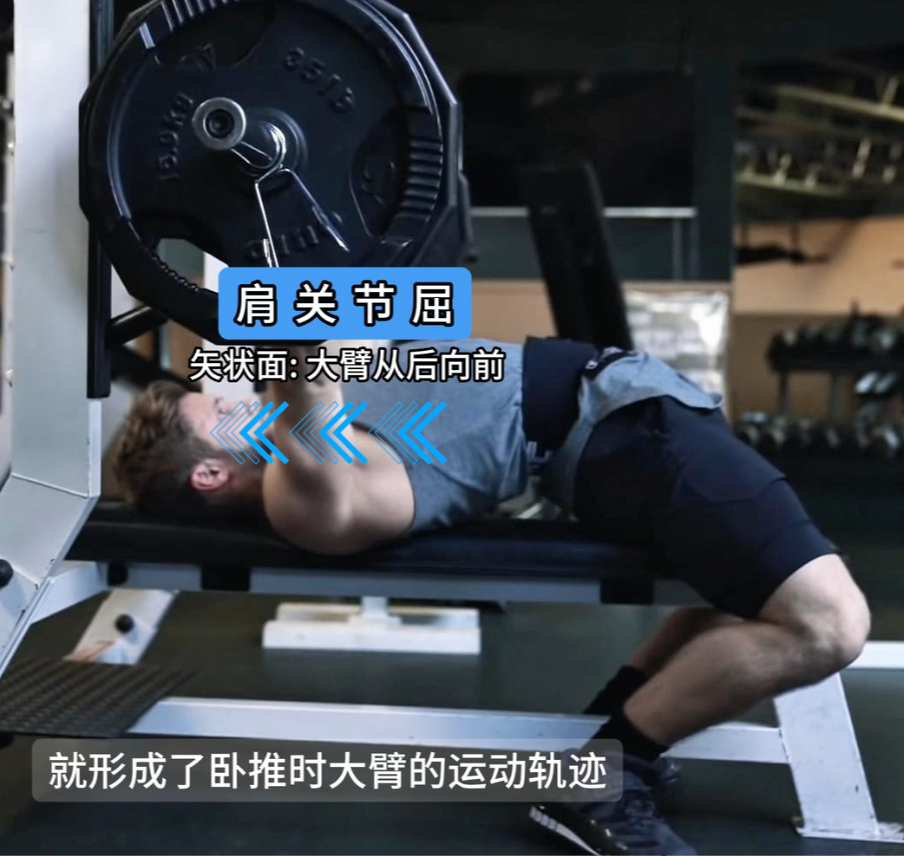

# 龙门架夹胸

动作整体是一个前后的动作  
手臂是一个水平内收的动作

向后吸气鼻子胸式呼吸  
向前呼气

向后肩胛收紧  
向前前锯肌发力，把肩胛往外拉，胸才能收紧。

手指压紧，不要空握，空握对肩的压力太大。

## 器械步骤

先调整座椅高度，让你在屁股稍微靠前坐的同时双脚可以舒服着地。

## 组次

12-15次

# 卧推

## 器械步骤

踩正双脚！后脚跟踩死了地！后侧链激活状态！

合适握距，手掌大鱼际小鱼际位置。

### 出杠

眼睛要在杠的正下方

顶髋关节，上半身是下斜的状态，收紧肩胛，