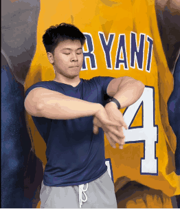
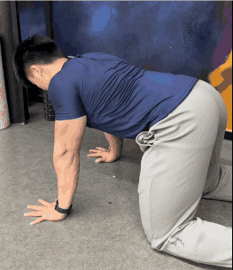
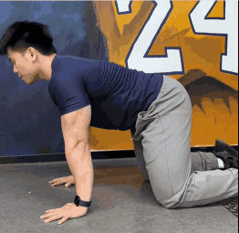
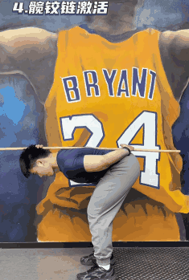
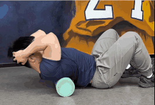
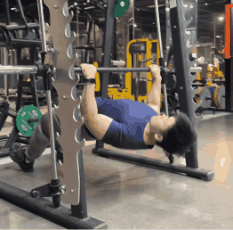
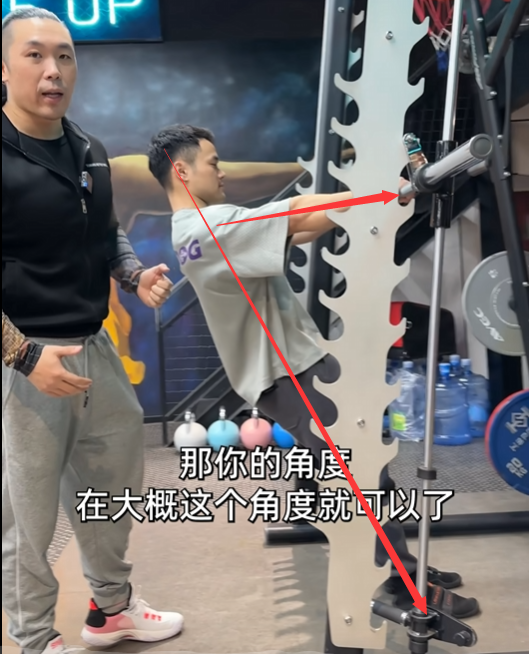
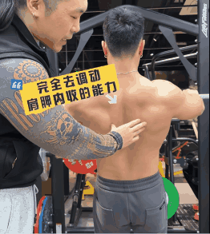

# 热身

- 手腕热身

- 肩胛激活

- 胸椎脊柱活动度

- 髋铰链激活

- 泡沫轴梳理

# 训练

## 澳式引体

4组10次

1. 调整身体角度和手臂握距

杆越放越低，强度就越来越高，杆低到一定程度的时候，腿最好伸直，这样称重更大。

握距就跟卧推一样就好，正好还能跟练胸日产生拮抗，所以其实可以练完胸之后去练背

手要全握不要半握

2. 肩胛内收带动身体

颈椎不要前引，上去的时候要加速而不是爆发力，是一种慢慢地挤压感。

3. 肩胛外放缓缓下落

要感受控制，这样收益最大，而不是夸一下下去。

### 呼吸

向上时候嘴巴呼气

向下的时候鼻腔吸气

### 定位

不是一个主要的动作，而是一个辅助动作，比如练胸之后为了拮抗一下胸的锻炼，而活动一下背部。

为了能做引体向上的一个基础训练

找不到中下斜方肌训练时的一个补强度训练。

##

