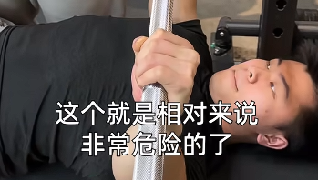
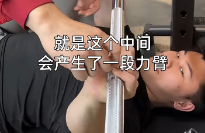
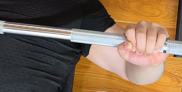
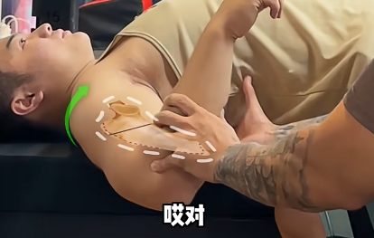
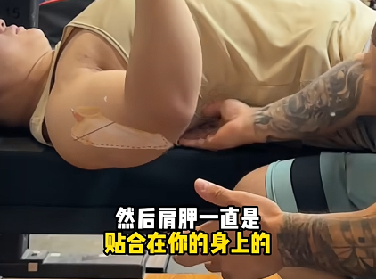

[圣凯王卧推动作分享](https://www.bilibili.com/video/BV1kx4y1U714/?vd_source=386bdb94ff2a430f8d22a6de9755030c)  
[圣凯王卧推动作分享2](https://www.bilibili.com/video/BV1yW42197Az/?vd_source=386bdb94ff2a430f8d22a6de9755030c)  
[卓叔增重卧推分享](https://www.bilibili.com/video/BV16i421h71B/?vd_source=386bdb94ff2a430f8d22a6de9755030c)  

# 先尝试把动作做标准

卧推有固定器械做法和自由器械做法。我是新手，对身体掌控力不足，怕受伤，使用固定器械做法更加安全。所以动作教学也按照固定器械来。

首先找到一把宽度足够的长凳，垂直位于史密斯卧推杆下。躺上去，先让自己的肩膀对准卧推杆。

双脚踩实地面，脚掌踩实地面，朝外35度左右，股四头肌发力固定你的髋关节，注意左右对称，核心收紧，身体做一个轻微拱桥（能放下一个手掌）。手找到小臂垂直于地面的宽度，将杆放到手心，因为出杆时要旋转，所以我们只要记住，最后杆位于既不塌腕也不立腕的中间位置。

下落离心，注意力在胸上不要卸力，肩胛内收，杆收到触胸再举起。

抬起向心，注意力在胸上，用胸带动大臂水平内收，注意顶峰收缩。

# 了解下这个动作

使用的肌肉：胸大肌，三角肌，肱三头肌

胸大肌：大臂的水平内收

三角肌前束：大臂屈（肩关节前屈）

肱三头肌：肘伸

## 做这个动作的时候我的肌肉处于一个什么样的状态？

离心：胸大肌被拉长；肱三头肌拉长；前锯肌拉长；肩胛下回旋，内收下降；中下斜方肌，收紧；菱形肌收紧；肱二头肌收紧；

向心：不要含胸，含胸三头发力会多。胸要做一个主动收缩并且不要卸力，肩胛不要卸力而是始终发力去顶。到顶的时候胸还是邦邦硬的。不推荐最顶峰的时候伸直手臂，超伸，这是大神的技巧，他们是在用胸大肌做刹车，而小白很容易使用肘关节刹车。

## 一直练一直涨胸进而就能又加大力度继续涨？

错误的，你还需要强化你的肌腱韧带，肩袖，肩胛，中下斜方肌，菱形肌，强化身体结构。

这样才可以在卧推过程中活动持续的发展。

# 神经对肌肉的募集动作

我们普通人一个问题是找不到肌肉在哪，比如叫你展个背，你都找不到背阔肌在哪里。而健身老手甚至可以随意控制自己的某一块儿肌肉，比如控制自己的胸。神经与肌肉的募集关系，新手没有建立。

新手这个动作找不到肩胛的状态的话，可以做一个训练，站立靠墙贴上，两个脚往前一点，伸直手臂，想象着有人在推你的手，然后你的手臂弯曲向墙的方向，此时肩胛骨内收，把你的身体往前顶起来。

然后再伸直手臂的时候，你的肩胛骨是一个被动的外展+微微上回旋的一个状态。

肩胛骨不内收的话，你会发现你的肩会被顶出去，这不是一个好的动作，对肩有伤害。

## 注意力集中在一个目的上

其目标就只有一点：锻炼胸大肌！大臂水平内收！

所以除此之外的所有都是我们应该避免的。

错误想法：我要把它推上去。 导致错误动作：含胸只是用手把重量推上去，胸根本没在水平内收。

正确想法：我要大臂水平内收去找胸肌发力的感觉。（甚至想着把身体往下推）  引到正确动作：推到顶部的时候顶峰收缩，而不是无限去垂直往上够。收下巴，不要仰头和伸脖子。下落过程胸肌缓缓卸力，而不是转而使用手臂承接下落力量。

# 动作细节

## 准备握距细节

握距：适中，职业力量的握距最大也就是食指放在最外侧光滑圆环处。而我们，需要根据自身情况找到握距能让肩胛在最高点不产生不适，在最低点可以触胸的位置。

其实握距没有正不正确，不同握距功能不同，

窄握：大臂接近躯干，大臂水平内收的角度变小了，伸肘抗阻的角度变多了，大臂屈抗阻的角度变多了。所以窄推更练三头。

比较合适的握：当下放杠铃，大臂和杠铃平行的时候（这时候还不是最下触胸位置），小臂垂直于地面这就是最合适的握距了。增加后背发力的感觉。最练胸了。

宽握：特点就是行程短了，可以上大重量了。

## 准备握法细节

过分立腕：自由卧推时一个开肘容易砸死自己

过分塌腕：产生不必要的力臂让你的腕肩有额外的压力

大鱼际小鱼际之间，让杆垂直你的小臂：

放在掌根肉垫位置并稍微往内旋转，扣住杠铃。

## 下落触胸细节

卧推就是要触胸的，不然没有肌肉张力。具体放到哪里，这个跟你的胸椎活动度有关，一般活动度不高的情况下保守点不要放太下面，就放在胸中间就好。不然肩膀容易受伤。

触到乳头水平线位置。

最下位置其实大臂和身体70度夹角就ok

## 下落肩胛细节

随着下落，肩胛是内收下降的状态，下回旋。没有开发过肩胛活动度的话会出现耸肩，肩旋前的一个动作。

如果肩胛上旋（或者说有点耸肩），你的肩前束参与就会过多，背部肌肉又无法用力，胸部更是不好发力，肱二头肌还会代偿。

最下位置错误做法：肩胛翘起，斜方肌无法用力

正确做法：肩胛贴合，前锯肌张力十足

掰杠：为了找到肩胛下回旋状态。

如果你想在一直内收肩胛的状态去做推举，除非你的胸非常给力，自由度非常高，不然是不可能在推的时候还处于内收状态。一般的时候肩胛都是要外展和上回旋。不过还是要尽量有意识全程内收肩胛锁定。

绝对绝对不要耸肩！

## 行程轨迹细节

直上直下，虽然锻炼肌肉很好，但是在卧推这里，直上直下对肩的压力非常大，非常容易造成肩峰撞击，不是一个可持续发展的一个动作。

起点垂直于胸，落点在胸中间的位置，所以放下的时候是会跟一开始出杠的肩支点之间错开，往身体下面走，会产生一个力臂，再推起到与肩垂直的一个状态。所以是一个斜上斜下的一个动作。所以史密斯固定卧推也是倾斜的。

一些大神会完全直上直下，但是他们的支点不在肩膀上，而是在胸上，这种属于高强度做法，需要你的胸有一定肌肉量。

## 小臂全程垂直于地面

## 非要做拱桥么？

大神：整个身体都贴在凳子上，大腿也伸的很直，仅仅靠胸大肌张力就可以完成水平内收啥的。

我们：没有那个金刚钻。内收肩胛，激活前锯肌，做一个拱桥会有一个非常好的支撑感，也更安全。