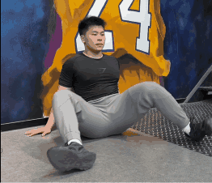

# 热身

## 足背曲激活

上臂需要在大腿内侧停靠，注意小腿的挤压脚背的程度不足

## 髋关节活动度激活

## 筋膜梳理

# 单腿硬拉

3 组 12 次

单腿硬拉是一项非常有效的单侧训练动作，主要锻炼腘绳肌（大腿后侧）、臀大肌和核心稳定性，同时还能提升身体的平衡能力和协调性

## 动作要点

### 起始姿势

- 双脚站立，脚与肩同宽，核心收紧，背部保持中立。
- 双手持哑铃、壶铃或徒手（初学者可以先徒手练习）。
- 重心放在一只脚上，另一只脚离地（初学可以稍微离地）并保持微微内旋。

### 动作过程

- 髋关节主导：以站立腿为支撑，髋关节向后推，身体前倾，同时另一条腿向后伸直。
- 保持背部中立：整个过程中，背部保持自然的生理曲线，避免弓背或塌腰。
- 下放负重：如果使用哑铃或壶铃，负重沿着支撑腿的正前方下放，直到感受到腘绳肌的拉伸。
- 起身还原：通过站立腿的臀部和腘绳肌发力，将髋关节推回到起始位置，身体恢复直立。

细节：
- 找到髋关节的旋转的感觉，而不是前后平移。
- 拿负重的手不要有那种够地面的感觉，而是仅仅握住，不怎么发力的。
- 想象肩和脚腕是一个整体转动着往下走
- 没有拿负重的手可以“扣臀”
- 脚趾要扣住地面，全脚掌踩死，整个脚掌受力
- 起身还原时也就是向心时要想像你的臀是往下压的。
- 基本离心 1.2s 向心 1s

### 呼吸节奏：

- 下放时吸气。
- 起身时呼气。

往下的时候一定是转动髋关节，而不是腰往下

# 杠铃深蹲

3组8-10次  RPE 7

杠铃深蹲是力量训练中最经典、最全面的复合动作之一，主要锻炼股四头肌（大腿前侧）、臀大肌、腘绳肌（大腿后侧）和核心肌群，同时还能提升全身力量、稳定性和运动表现。

## 动作要点

### 起始姿势

- 杠铃位置：

        - 高位深蹲：杠铃放在斜方肌上方（颈部下方），适合初学者和注重膝关节主导的深蹲。
        - 低位深蹲：杠铃放在肩胛骨后侧（靠近后背中部），适合更注重髋关节主导的深蹲。
- 握距：双手握住杠铃，握距略宽于肩膀，肘部微微向下夹紧，保持上背部紧张，有一个肩胛内收的感觉，但不要太过，不要形成一个挺胸的前后，视线平视角稍微往下看。
- 站姿：双脚与肩同宽或略宽，脚尖自然朝外（约15-30度），根据个人髋关节活动度调整。
- 核心收紧：吸气，收紧腹部，像是准备承受冲击，保持脊柱中立。

### 动作过程
- 下蹲：

        髋关节和膝关节同时启动，想象“坐在椅子上”的动作。
        膝盖朝脚尖方向移动，避免内扣。
        背部保持中立，胸部抬起，目视前方或稍微向下。
        下蹲至大腿与地面平行（或更低，视个人活动度而定），感受到臀部和大腿的拉伸。
- 起身：

        通过脚跟发力，髋关节和膝关节同时伸展，身体回到站立姿势。
        顶端时臀部轻微收紧，但不要过度后倾。

### 呼吸节奏：
下蹲时吸气。
起身时呼气。

瓦式呼吸增加腹内压。

# 保加利亚深蹲

3组12次  RPE 7

保加利亚深蹲（Bulgarian Split Squat）是一种单腿训练动作，主要锻炼股四头肌（大腿前侧）、臀大肌和腘绳肌（大腿后侧），同时还能提升单侧力量、平衡能力和核心稳定性。

## 动作要点

### 起始姿势

- 站位：

        背对一个凳子或箱子，距离约为两脚的长度（根据个人身高调整）。
        一只脚放在凳子上，脚背朝下（也可以用脚尖支撑，视个人舒适度，脚尖因为不借力所以更难，有意识地不发力，而且后脚跟向后）。
        另一只脚站在地面，脚尖朝前（不要内扣，可以稍微向外），重心放在站立腿上。

- 握重方式：

        徒手：双手自然放在身体两侧。
        哑铃：双手各持一个哑铃，垂直放在身体两侧。
        杠铃：杠铃放在肩膀上（类似深蹲的握法）。

- 核心收紧：收紧腹部，保持上半身挺直，避免过度前倾或后仰。

### 动作过程
- 下蹲：

        髋关节和膝关节同时启动（屈髋加屈膝），身体向下沉，前腿膝盖弯曲，后腿膝盖缓慢向地面靠近（但不要触地）。
        保持前腿膝盖与脚尖方向一致，避免膝盖内扣。
        下蹲至前腿大腿与地面平行（或更低，视个人活动度而定），感受到前腿和臀部的拉伸。
- 起身：

        通过前腿脚跟发力，将身体推回到起始位置。
        后腿保持稳定，不主动发力。
呼吸节奏：

下蹲时吸气。
起身时呼气。

# 高脚杯深蹲

3组12次  RPE 7

高脚杯深蹲（Goblet Squat）是一种非常适合初学者的深蹲变式，同时也是一个优秀的训练动作，用于改善深蹲姿势、提升下肢力量和增强核心稳定性。它主要锻炼股四头肌（大腿前侧）、臀大肌和腘绳肌（大腿后侧），并且对髋关节活动度和深蹲技术有很好的帮助。

## 动作要点

### 起始姿势
- 握持负重：

        使用一个哑铃或壶铃，双手握住负重的顶部（像捧着一个“高脚杯”），将其靠近胸前，肘部微微向下夹紧。
        保持上背部紧张，核心收紧。
- 站姿：

        双脚与肩同宽或略宽，脚尖自然朝外（约15-30度），根据个人髋关节活动度调整。
        重心放在脚掌中部或脚跟，确保脚掌完全贴地。

### 动作过程

- 下蹲：

        髋关节和膝关节同时启动，身体向下沉，想象“坐在椅子上”的动作。
        膝盖朝脚尖方向移动，避免内扣。
        背部保持中立，胸部抬起，目视前方或稍微向下。
        下蹲至大腿与地面平行（或更低，视个人活动度而定），感受到臀部和大腿的拉伸。
- 起身：

        通过脚跟发力，髋关节和膝关节同时伸展，身体回到站立姿势。
        顶端时臀部轻微收紧，但不要过度后倾。
呼吸节奏：

下蹲时吸气。
起身时呼气。

# 哑铃推举

4组12次  RPE 8.5

# 单手侧平举

4组15次

# 筋膜梳理

