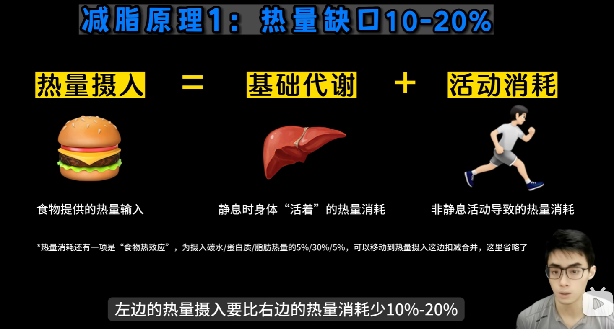
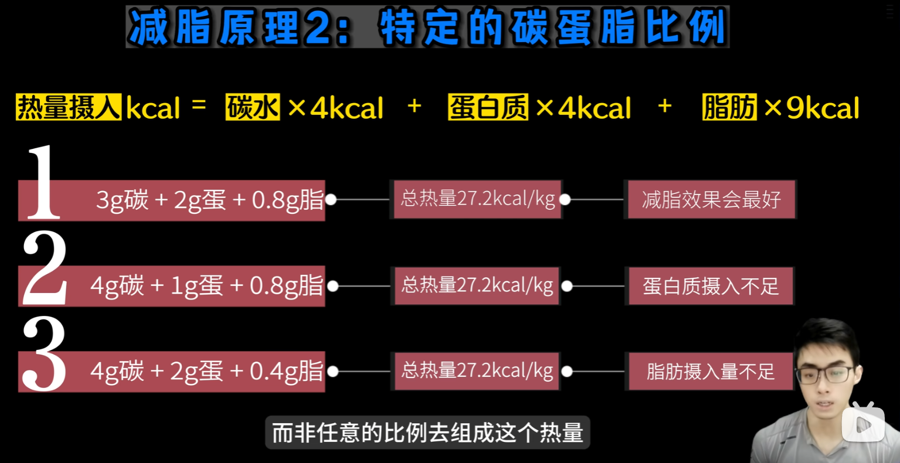
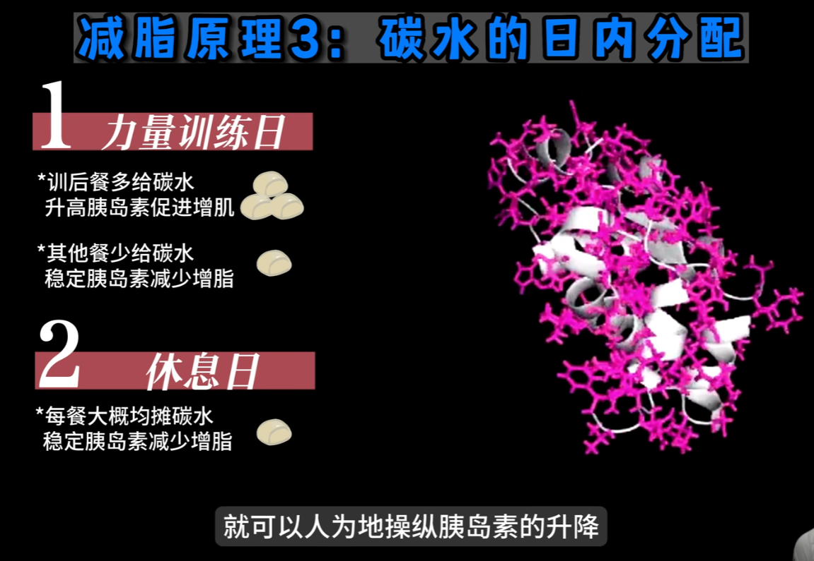
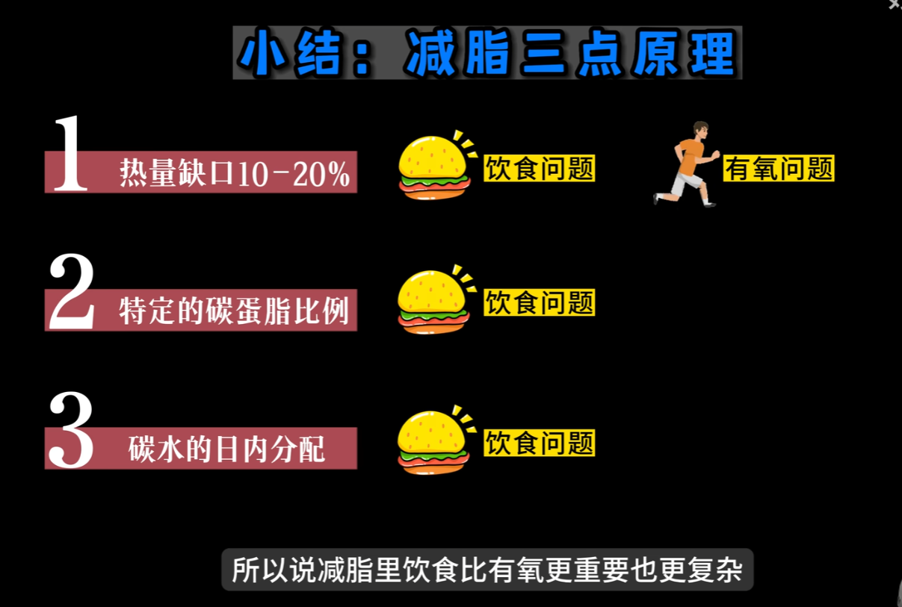
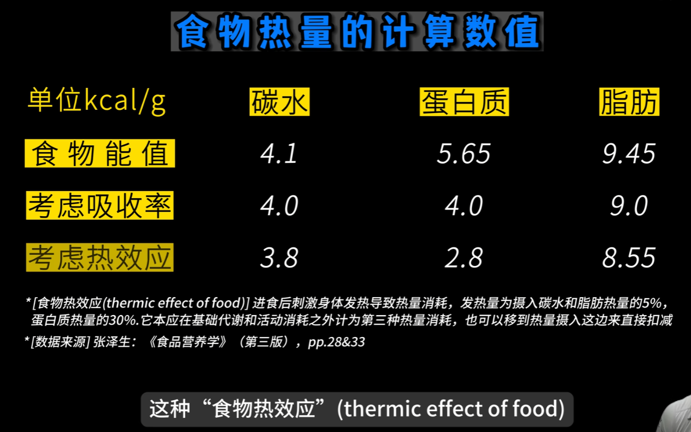
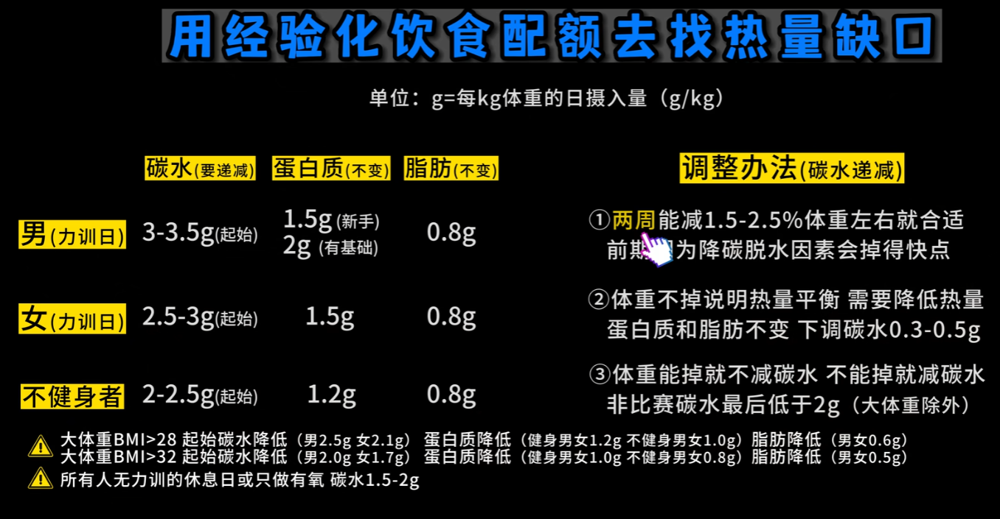
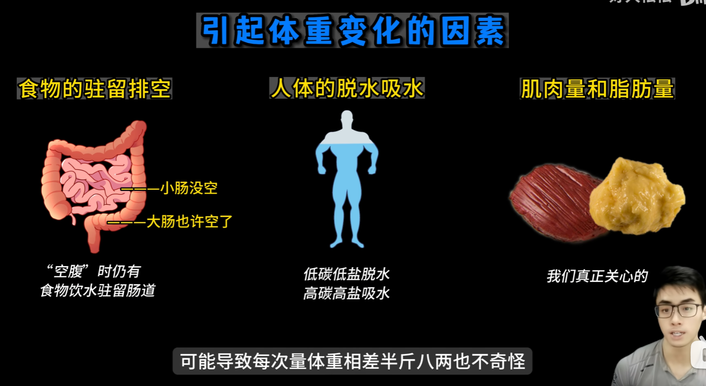
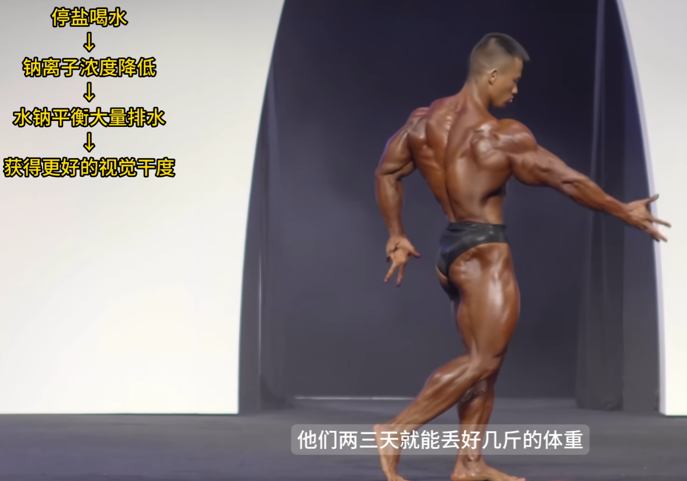
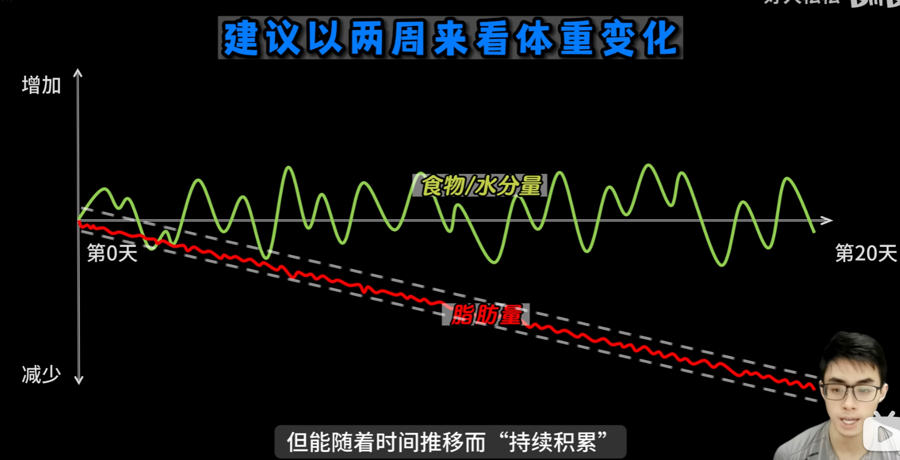

# 三个原理

让右边大于左边，10%-20%

找到健康的经验化碳蛋脂

在热量一定，碳蛋脂配额也一定的情况下，将碳水放在不同的时间段去吃，就可以人为地操作胰岛素的升降，以达到不同的效果。比如，在力量训练日将碳水放在训练后的一餐多吃，让胰岛素升高，以达到增肌的目的，而今天其他餐的碳水适当减少。而在休息日时，将碳水均摊到各餐中，稳定胰岛素减少增脂。碳水的 timing (时机)是减脂期保护肌肉的一个重要策略

# 摄入总量

## 影响体重的因素

- 空腹很难达成：就算拉屎之后，也只是排除大肠段的屎。
- 脱水吸水影响很大：比如碳水摄入量能直接影响肌糖原
(肌肉里的淀粉)储量，1克肌糖原能留住3克水，人体内300-500g的肌糖原变化就会造成2、3斤的体重变化。

- 肌肉脂肪的合成分解非常慢
