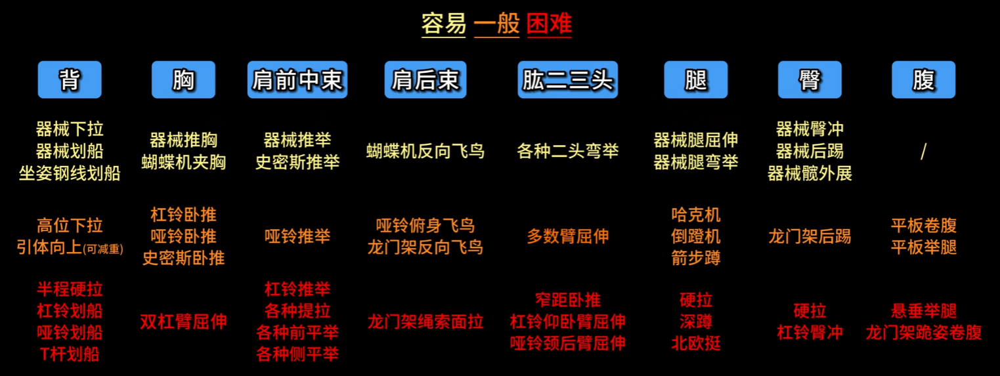
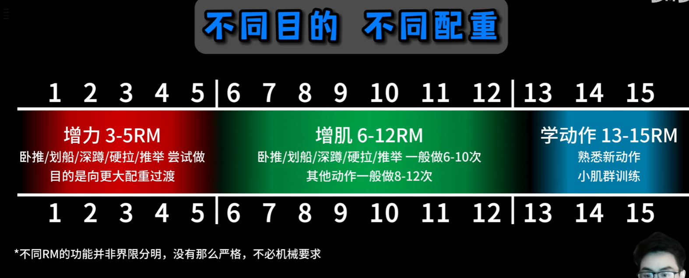
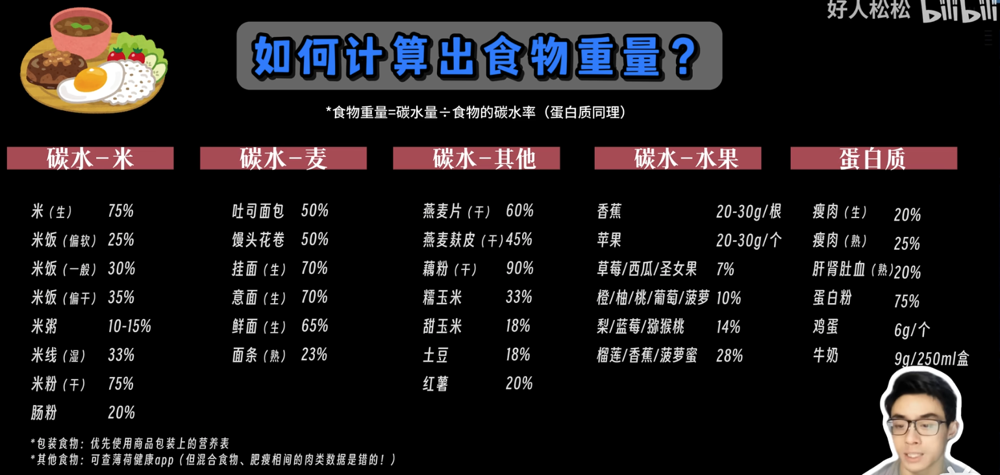

[好人教程](https://www.bilibili.com/video/BV1Hk4y187jF/?vd_source=386bdb94ff2a430f8d22a6de9755030c)

# 分化

三分化 
- 背 + 肩后束 + 肱二头
- 胸 + 肩前束 + 肱三头
- 腿 + 腹

肱三头不宜和背一起练，虽然划船的肩关节伸可以练到肱三头，但是只能练到其长头，而其共有3个头，推胸可以都连到，所以还是适合和胸一起练。

## 胸

推胸和夹胸两种

## 背部

划船和下拉两种

## 肱三头

臂屈伸和肩关节伸两种

## 肱二头

弯举

其实也是臂屈伸，只是和肱三头的方向不同，但是肱三头先叫这个名字了，就只好叫别的了，比如弯举。

# 训练计划

背放在胸之前。腿、背、胸。这样一周 3 次地去练。

## 热量平衡盈余亏损理论

热量摄入 碳蛋脂对应 4/4/9 大卡 = 基础代谢 + 活动消耗 + 食物热效应 碳蛋脂 5% 30% 5%
热量摄入 碳蛋脂对应 3.8/2.8/8.6 大卡 = 基础代谢 + 活动消耗

基础代谢：静息维持身体运转的热量消耗
活动消耗：一切肢体活动的热量消耗
食物热效应：进食后自动额外散热

热量平衡：热量摄入 = 基础代谢 + 活动消耗 + 食物热效应

增肌需要多吃 10% - 20%
减脂需要少吃 10% - 20%

理论存在，但是每个人都需要监测出自己不增不减的时候吃的热量是多少，才好掌控合适的增肌减脂，这需要有个开始。

## 经验化饮食配额

单位：g 每公斤体重的日摄入量。

## BMI

身体质量指数，是 BMI Body Mass Index 指数，简称体质指数，是国际上常用的衡量人体胖瘦程度以及是否健康的一个标准。

计算公式为： BMI = 体重 ÷ 身高的平方  体重单位：千克；身高单位：米

## 影响体重的因素

占比依次减少，上面的最高。

吃的食物

## 怎么吃

全脂牛奶：12克碳水，9克蛋白质，9克脂肪

两个全蛋：12g蛋白质，6g脂肪

每日坚果：6.4g碳水，4.3g蛋白质，13.5g脂肪

早：18.4g碳水 25.3g蛋白质 28.5g脂肪

午：216g生米 162g碳水  102     剩饭60g
183g熟瘦肉  47.75g蛋白质

早午：120g碳水 73g蛋白质 28.5g脂肪
差：139g碳水  64g蛋白质 50g脂肪

    全蛋：6g蛋白质 3g脂肪
    蛋白：3g蛋白质 0g脂肪
    蛋黄：3g蛋白质 3g脂肪

