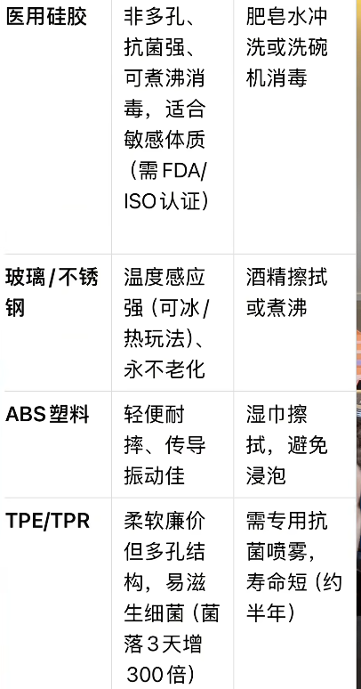
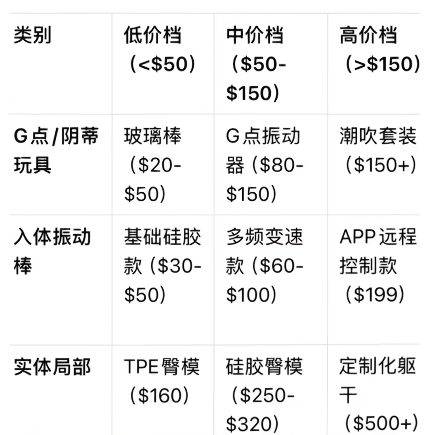

- [材质安全](#材质安全)
- [作用点](#作用点)
  - [C点](#c点)
  - [G点](#g点)
  - [综合性玩具](#综合性玩具)
- [价位表](#价位表)
- [目的](#目的)
  - [潮吹](#潮吹)
  - [敏感体质](#敏感体质)
  - [性价比 / 入门](#性价比--入门)

# 材质安全

安全优先级 : 医用硅胶 > 玻璃/不锈钢 > ABS 塑科 > TPE

# 作用点

18-30 岁 以 C 点为主，通道为辅。男伴年轻，技术不好，很难通道高潮。

内外兼顾    35 岁以上

## C点

阴蒂刺激类  

## G点

G点刺激，通道 4-5 cm，15°-45°的弧度，精准按压，配合向上提拉的手法。

前花园，≤ 3.5cm，长度 10 - 12 cm。

后花园，基座防滑，30°-45°的弧度

## 综合性玩具

# 价位表

# 目的

## 潮吹

金属 G 点棒 + 水基润滑

## 敏感体质

医用硅胶，避免 tpe + 水溶性润滑 + ph中性清洁剂

## 性价比 / 入门

玻璃按摩棒 / 不入体穿戴 / 指扣硅胶点动棒等