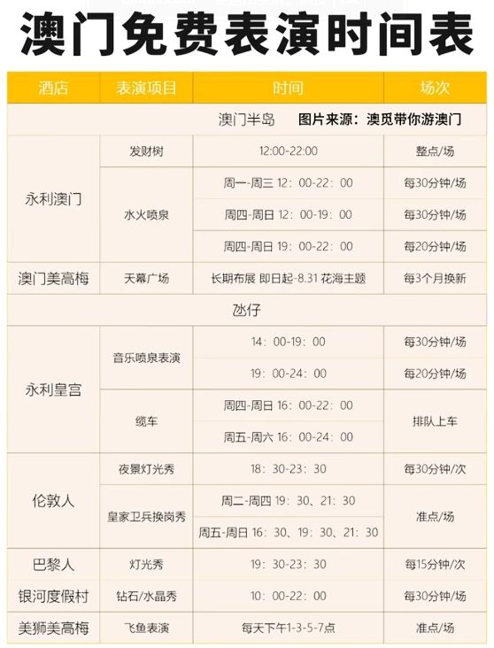

# 威尼斯人

澳门仿制

威尼斯总督府：又称威尼斯公爵府，始建于 9 世纪，是欧洲中世纪哥特建筑，因与伊斯兰国家的文化贸易往来，其立面的席纹图案受伊斯兰建筑影响。它曾是威尼斯共和国的政府办公楼，现在是艺术博物馆。总督府建筑风格独特，巨型上层建筑建在轻盈精巧的镂花拱顶上，内部有许多著名景点，如 “纸门”“大国会厅”“十人会议” 厅等，还收藏有众多古董铭文和雕塑作品，1998 年被联合国教科文组织列为世界遗产。

叹息桥：建于 1600-1603 年，是一座早期巴洛克式风格的密封式拱桥，由白色石灰岩铸成。桥两端连接着总督府和威尼斯监狱，是古代由法院向监狱押送死囚的必经之路。死囚在总督府接受审判后，经过这座密不透气的桥时，只能透过小窗看见蓝天，从此失去自由，会不由自主地发出叹息之声，因此得名。不过，现在因电影《情定日落桥》等影响，叹息桥也成为了浪漫的象征，传说恋人们在桥下接吻就可以天长地久。

圣马可钟楼：位于威尼斯的圣马可广场，是广场上最高的建筑，高 99 米，也是威尼斯的城市坐标之一。每到整点时，塔顶的五钟齐鸣。登顶钟楼可以俯瞰水城威尼斯的全貌及美丽的澙湖风光，还能眺望远处的阿尔卑斯山，同时也是拍摄安康圣母教堂全貌的最佳地点之一。

黄金宫：始建于 1440 年，位于大运河岸边，由威尼斯最有影响力的贵族家族之一 —— 孔塔里尼家族兴建。因其外墙曾用金箔装饰、或漆上鲜艳的群青颜料，在阳光下闪闪发光，故而得名。它是现存最伟大的威尼斯哥特式建筑作品之一，现在是一座收藏中世纪绘画和雕塑的博物馆，馆内收藏了威尼斯画派从 14 世纪到 18 世纪的绘画珍品。

# 巴黎人

# 伦敦人

电话亭  这个里面也有安德鲁蛋挞

# 永利皇宫

大喷泉

