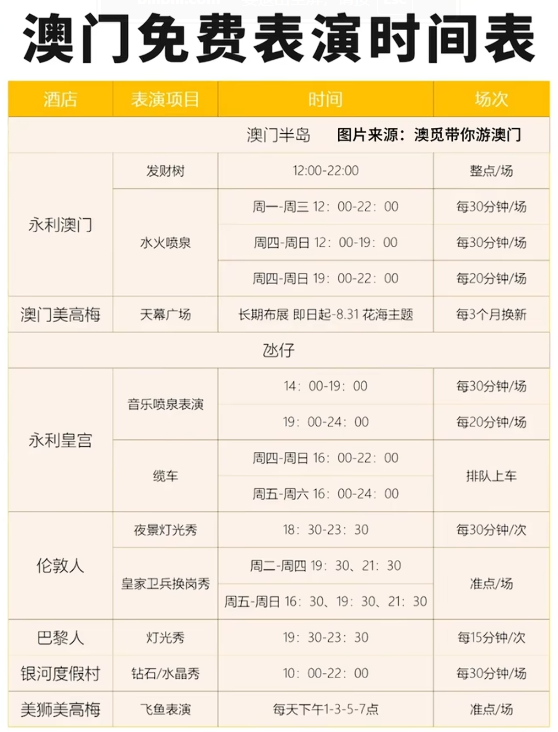
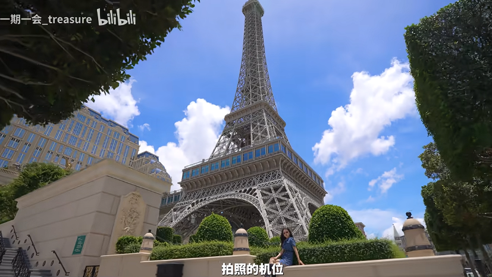

- [新葡京](#新葡京)
  - [老板](#老板)
- [金碧汇彩娱乐城](#金碧汇彩娱乐城)
- [威尼斯人，巴黎人，伦敦人 开卡详情](#威尼斯人巴黎人伦敦人-开卡详情)
- [威尼斯人](#威尼斯人)
- [巴黎人](#巴黎人)
- [伦敦人](#伦敦人)
- [新濠影汇](#新濠影汇)
- [美高梅](#美高梅)
- [永利皇宫](#永利皇宫)
- [十六浦酒店](#十六浦酒店)
- [赌场开卡注意事项](#赌场开卡注意事项)

# 新葡京

吃喝上有免费的奶茶、咖啡和茶等。奶茶太甜了，不好喝

三楼有收费的餐饮，有人说可以找里面的服务大使送猪扒包

就一进门去找穿西装带胸牌的小姐姐开卡，然后再去二楼的会员柜台开会员卡，开卡送100元上台桌的筹码或者是50元用于老虎机或者饺子机的筹码。咱们也就玩玩老虎机，那个100元上桌的还需要加钱。

充完卡以后再去一楼找工作人员，教你怎么用机器很简单，就是下注，按按中间几个相同的图案就能赢钱，赢了以后记得兑换，会出现白色的小卡片拿去账房换现金就行了

也有说是50块筹码或者20块老虎机的

## 老板

何鸿燊出生于香港豪门望族，祖父是大买办何福、伯公是鼎鼎大名的何东爵士。何鸿燊的父亲是何世光，一位在商界政界享有盛誉的人士。

何鸿燊出生时，父亲何世光的事业正处高峰。何鸿燊聪明伶俐，父亲对他疼爱有加，便在香港赤柱海旁兴建了一幢度假别墅，以何鸿燊的英文名Stanley Lodge命名，希孩子长大后，能享富贵荣华。

13岁时候，何鸿燊的命运遭遇转折，父亲何世光投资股票破产，负债累累，家里的所有资产变卖掉，还不够抵债，随后何世光偷偷离开香港逃往越南。

何鸿燊不久便从富家子弟的旧梦中，彻底清醒过来。他开始发愤苦读。1939年，何鸿燊以优异的成绩考取香港大学。

随后不久，战争在香港一触即发，何鸿燊攥着在报警室工作8天的10港元津贴，挤上了去往澳门的小船。

何鸿燊发迹的“第一桶金”，来源于澳门联昌贸易公司。靠着能说流利的英语，他被引荐当上了公司的秘书。同时，何鸿燊甘冒生命风险押船出海交易货物，后跻身为公司合伙人，更从公司取得100万港元分红。年轻的百万富豪让何鸿燊昔日的亲戚朋友，对他刮目相看。

随后，何鸿燊离开联昌，到贸易局任供应部主管，与首任澳门行政长官何厚铧的父亲何贤共事。两年后，他创办了澳门火水(煤油)公司；后来又与恒生银行创办人何善衡共同开办大美洋行，从事纺织品生意。1953年，何鸿燊回到香港，创办了利安建筑公司，从事地产和建筑生意。到20世纪50年代末，他的资产已经达到1000万港元，跻身香港超级富豪行列。

在澳门，博彩业一直十分兴旺。最初，澳门的博彩业管理十分混乱，赌场林立，鱼龙混杂。1961年，澳葡当局颁布法规，首次明确赌博是“特殊的娱乐”，规定博彩业须通过专营制度实施。何鸿燊看准机会，重返澳门，与霍英东等人合作，一举拿下赌场独家专营权，迈出了“赌王”之路的第一步。

次年，澳门旅游娱乐有限公司(以下简称“澳娱”)正式成立，霍英东任董事长，何鸿燊为董事总经理。1970年，由澳娱投资的葡京娱乐场落成启用，直到现在仍是游客在澳门的必去之地。

1970年6月，斥资6000多万澳门元建造的葡京酒店首期工程竣工，随后，何鸿燊把赌场交由亲信坐镇，走出“城堡”，到商界大展拳脚。

他在信德船务的基础上，创建信德集团，核心业务仍是港澳间的客运。1973年，信德集团在香港上市。1994年3月底，信德集团的市场价值高达120亿港元。

何鸿燊不仅要“控制”港澳间的海上客运，还要“制空”。到1990年底，直升机航线正式开通，以吸引那些赶时间、寻求刺激的乘客。

澳门回归祖国后，澳门赌业的规模在2006年超过了美国拉斯维加斯，何鸿燊的财富随着赌业王国的急剧扩张而暴涨，最高峰时控制着5000亿港元的资产，个人财富700亿港元，位居港澳十大超级富豪之列。

2018年，澳博控股宣布，何鸿燊自同年6月12日起退任主席、执行董事及董事会执行委员会委员职务，获委任为“荣誉主席”。

有人评价说，何鸿燊是个不赌之“赌王”。

# 金碧汇彩娱乐城

一种香港黑社会电影里面走出来的感觉，比较平民化下的注的金额比较小

开卡呢需要去三楼填信息，然后再去二楼帐篷去选择100元的上台筹码或者100元的老虎机充值，先充值到机器里面，然后会给一张凭条，再去下楼找员工充值到机器内就可以用了，玩法和新葡京是一样的

# 威尼斯人，巴黎人，伦敦人 开卡详情

三家无论在哪里开卡都是一样的，会送一些餐饮购物券，大概就是100元或者50元的代金券，聊胜于无吧，没啥用，额外再送你一张100元的筹码，但是只有投入500以上才能玩，不太适合白嫖

# 威尼斯人

澳门仿制

威尼斯总督府：又称威尼斯公爵府，始建于 9 世纪，是欧洲中世纪哥特建筑，因与伊斯兰国家的文化贸易往来，其立面的席纹图案受伊斯兰建筑影响。它曾是威尼斯共和国的政府办公楼，现在是艺术博物馆。总督府建筑风格独特，巨型上层建筑建在轻盈精巧的镂花拱顶上，内部有许多著名景点，如 “纸门”“大国会厅”“十人会议” 厅等，还收藏有众多古董铭文和雕塑作品，1998 年被联合国教科文组织列为世界遗产。

叹息桥：建于 1600-1603 年，是一座早期巴洛克式风格的密封式拱桥，由白色石灰岩铸成。桥两端连接着总督府和威尼斯监狱，是古代由法院向监狱押送死囚的必经之路。死囚在总督府接受审判后，经过这座密不透气的桥时，只能透过小窗看见蓝天，从此失去自由，会不由自主地发出叹息之声，因此得名。不过，现在因电影《情定日落桥》等影响，叹息桥也成为了浪漫的象征，传说恋人们在桥下接吻就可以天长地久。

圣马可钟楼：位于威尼斯的圣马可广场，是广场上最高的建筑，高 99 米，也是威尼斯的城市坐标之一。每到整点时，塔顶的五钟齐鸣。登顶钟楼可以俯瞰水城威尼斯的全貌及美丽的澙湖风光，还能眺望远处的阿尔卑斯山，同时也是拍摄安康圣母教堂全貌的最佳地点之一。

黄金宫：始建于 1440 年，位于大运河岸边，由威尼斯最有影响力的贵族家族之一 —— 孔塔里尼家族兴建。因其外墙曾用金箔装饰、或漆上鲜艳的群青颜料，在阳光下闪闪发光，故而得名。它是现存最伟大的威尼斯哥特式建筑作品之一，现在是一座收藏中世纪绘画和雕塑的博物馆，馆内收藏了威尼斯画派从 14 世纪到 18 世纪的绘画珍品。

# 巴黎人

从六楼出来，有个观景台可以看

巴黎铁塔下的爱情（贵就不说了，据说全是人妖）

# 伦敦人

电话亭  这个里面也有安德鲁蛋挞

里面有小景观

# 新濠影汇

大商场哦，里面大VR游乐场哦

8字摩天轮，扫描二维码，注册会员会便宜些。

开卡赠送20也没啥意思

# 美高梅

免费的奶茶和蛋挞

黑狮珍珠鲜奶，金狮珍珠奶茶 

# 永利皇宫

大喷泉  晚上8点

吃喝选择非常丰富

冻奶茶好喝；热奶茶又齁甜；小青柠很好喝，有点像山姆的小青柠汁

紫菜肉松面包也好吃，但是瑞士卷和蛋挞就一般

攻略呢先去会员柜台开卡，下载app，这家线上化做的比较不错，然后会送26的积分，花费20积分可以抽奖，奖品是100~1000元的筹码，大多人中都是100，可以选上台或者机器，充到机器里面，还要再塞十元港币，这个钱是可以退的

门口是有缆车的，大家一定要去酒店二楼排队，千万不要去户外那个站点，排二楼的人要少，坐缆车上看看音乐喷泉，太美了。而且大家如果是住在永利皇宫酒店，或者已经前面注册了人类的会员，是可以获得优先排队权的

# 十六浦酒店

猪扒包

# 赌场开卡注意事项

- 千万要带港澳通行证，开卡都是需要证件的，提前换港币，娱乐场所都是用港币的，极少数才用澳门元。赌场换汇率很差，去银行换比较划算
- 心态要好 就当用少许的钱去游戏厅网吧玩玩
- 荷官并不性感，大多是表情麻木，神情委顿的中年人
- 娱乐场里有不少销售一次性爱情的性感小姐姐
- 澳门刷抖音会打开全新世界