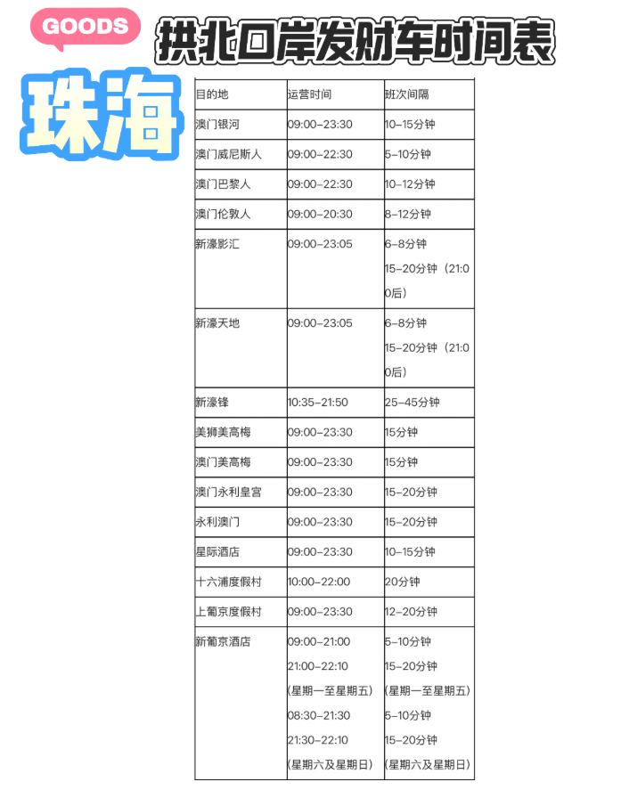

恋爱巷 大三巴 大炮台 三街会馆  主教山小堂  渔人码头  大赛车博物馆 东望洋灯塔  经典机位  疯堂斜巷

# 上方岛

恋爱巷 大三巴（附近有很多可以无限吃的猪肉干）   大炮台 女娲庙（去不去） 玫瑰圣母堂 三街会馆 澳门市政署 主教山小堂 烧灰炉公交站28B青州方向 到澳门渔人码头  赛车博物馆   东望洋灯塔   何东中葡小学   葡京娱乐城拍摄位

恋爱巷 大三巴（附近有很多可以无限吃的猪肉干） 从大三巴乘坐扶梯可以快速到达大炮台 女娲庙（去不去） 玫瑰圣母堂 三街会馆 澳门市政署 主教山小堂 烧灰炉公交站28B青州方向 到澳门渔人码头  赛车博物馆   东望洋灯塔   何东中葡小学   葡京娱乐城拍摄位

澳门市政署 主教山小堂 这段路差不多1.3公里，这条路上会有很多吃的，很多初高中生会在这里吃饭。

永利澳门酒店  发财鱼缸，发财树（中午12:00 到 晚上 22:00 每隔一个小时表演一次）

美高梅，可以免费领取奶茶，

# 交通

MT1路公交车可以横穿两岛，从美高梅到官也街。

# 下方岛

官也街：100多米的小吃街，可以填饱肚子。晚上人很多建议中午在这儿吃。（旺记咖啡）

澳门银河酒店：银河酒店的大厅，每天上午十点开始，每半个小时就有一次超巨大的钻石表演。

威尼斯二楼：假的天空，伪造的威尼斯建筑。可以说是相当牛逼了。

走廊穿到巴黎人。大酒店老大了，会走很远的路。巴黎人下来是一个缩小版的巴黎铁塔。

伦敦人（夜晚来）

永利皇宫

轻轨看澳门夜景。 从永利皇宫到牌角

石排湾郊野公园：免费，有四只大熊猫（轮流上班）

荔枝碗 （尚可） 路环（最佳） 路环圣方济各圣堂（最佳）  十月初五马路（最佳）   安德鲁饼店（蛋挞）（最佳）  3345咖啡店（最佳）

竹湾豪园看海。（尚可）

黑沙海滩（一般）

龙环葡韵湿地  葡人之家
