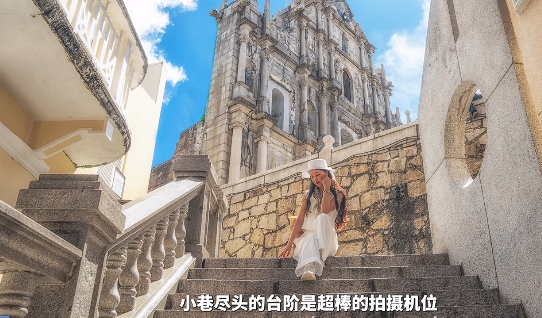
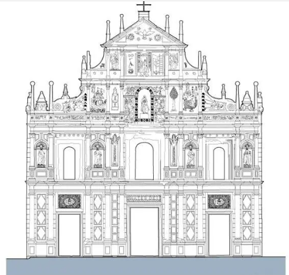

7:30    横琴澳方口岸公交站。乘坐25B公交车，这辆车早班每8分钟一趟，一路坐到水坑尾站，耗费40分钟

8:30    水坑尾站

8:40    澳门主教座堂。仁慈堂。市政署大楼。

9:10    三街会馆

9:30    玫瑰圣母堂

10:10   女娲庙

10:20   恋爱巷，大三巴（据说这里有很多试吃猪肉铺）

隐藏景点（哪吒庙，哪吒展馆）

10:50   大炮台

11:20   疯堂斜巷

11:40   何东中葡小学（拍照打卡）

12:00   东望洋灯塔

12:30   葡京娱乐城

隐藏景点（金碧汇彩娱乐城）

13:10   永利澳门酒店

13:50   澳门美高梅金殿  在这里就需要看一下MT1路了，从城市日前地坐到澳门运动场

- [澳门主教座堂](#澳门主教座堂)
  - [一句话总结](#一句话总结)
- [仁慈堂](#仁慈堂)
  - [一句话总结](#一句话总结-1)
- [市政署大楼](#市政署大楼)
  - [一句话总结](#一句话总结-2)
- [三街会馆](#三街会馆)
  - [名字由来](#名字由来)
  - [文化活动](#文化活动)
    - [螺旋线香](#螺旋线香)
  - [历史沿革](#历史沿革)
  - [建筑布局](#建筑布局)
  - [一句话总结](#一句话总结-3)
- [玫瑰圣母堂](#玫瑰圣母堂)
  - [历史沿革](#历史沿革-1)
  - [建筑特色](#建筑特色)
  - [一句话总结](#一句话总结-4)
- [女娲庙](#女娲庙)
  - [一句话总结](#一句话总结-5)
- [恋爱巷](#恋爱巷)
- [大三巴](#大三巴)
  - [简介](#简介)
  - [建筑特色](#建筑特色-1)
    - [第一层](#第一层)
    - [第二层](#第二层)
    - [第三层](#第三层)
    - [第四层](#第四层)
    - [第五层](#第五层)
  - [文化和历史意义](#文化和历史意义)
    - [核心历史意义：东西方交融的 “活化石”](#核心历史意义东西方交融的-活化石)
    - [背后的关键故事：从 “东方最美教堂” 到 “遗址牌坊”](#背后的关键故事从-东方最美教堂-到-遗址牌坊)
  - [音乐会](#音乐会)
  - [一句话总结](#一句话总结-6)
- [哪吒庙](#哪吒庙)
  - [一句话总结](#一句话总结-7)
- [大炮台](#大炮台)
- [历史沿革](#历史沿革-2)
  - [一句话总结](#一句话总结-8)
- [疯堂斜巷](#疯堂斜巷)
  - [命名由来](#命名由来)
  - [文化活动](#文化活动-1)
  - [一句话总结](#一句话总结-9)
- [东望洋灯塔](#东望洋灯塔)
  - [历史](#历史)
  - [一句话总结](#一句话总结-10)
- [新葡京](#新葡京)
  - [老板](#老板)
  - [一句话总结](#一句话总结-11)
- [金碧汇彩娱乐城](#金碧汇彩娱乐城)
- [永利澳门酒店](#永利澳门酒店)
  - [表演时间](#表演时间)
- [澳门美高梅金殿](#澳门美高梅金殿)

# 澳门主教座堂

圣母圣诞堂（Catedral Igreja da Sé）是天主教澳门教区的主教座堂，位于大堂前地，于1563年前开放。

澳门主教座堂又称“大堂”，为澳门历史城区的一部份，这里曾是历任澳门总督上任必到地，象征神圣的权力。400多年来历经风雨多次修缮重建，如今壮丽堂皇的建筑建于1937年，也已有近百年的历史。

这是一座外表呈现灰色的三合土建筑，建筑富西班牙宗教色彩，外在大气沉稳、宏伟典雅，内部精丽巧饰，曾存有不少天主教遗物及古迹。教堂可分为两大部分，正中的是教堂主体，进入其间可以感受到庄严圣洁的气氛。入口处是一面木制葡萄牙屏风，素洁的墙壁上装饰简洁。两侧墙上都有高窗，窗户上镶嵌着富有宗教艺术气息的彩绘玻璃。如果遇着周日，可以进去听一会弥撒。教堂前地有一个小型的广场，地上铺设黑白两色的葡式碎石，广场内有一座特色的小型喷泉，将这里营造成一个优雅宁静的景点。

教堂的另一部分是侧边的钟楼，大钟英国制造，为了纪念葡萄牙国王伯多禄五世登基。如今澳门有重要的弥撒、大礼、瞻礼、婚礼，钟楼里就会响起钟声提示当地的民众。

## 一句话总结

历任澳门总督上任地，象征神圣权利。分为大堂和钟楼两部分。钟楼纪念葡萄牙国王伯多禄五世登基

# 仁慈堂

澳门仁慈堂是中国澳门历史悠久的慈善机构，由首任主教贾尼路于1569年创立，隶属澳门历史城区世界文化遗产组成部分。该机构初期设立白马行医院、育婴堂等设施，18世纪中叶建成巴洛克风格大楼，1905年形成现存新古典主义建筑。管理机构由13名理事组成，经费源于政府拨款及慈善彩票收入。

仁慈堂博物馆于2001年开放，展出文物2000余件，包括贾尼路遗骨等。下设机构涵盖安老院、盲人重建中心及托儿所，1960年成立的盲人中心提供职业培训。2009年活化婆仔屋为文创空间曾于2002年、2009年获澳门政府颁授仁爱功绩勋章。2024年11月获澳门特区政府授予金莲花荣誉勋章

## 一句话总结

慈善机构，由首任主教贾尼路于1569年创立。下设机构安老院、盲人重建中心、托儿所等。内藏有贾尼路遗骨。

# 市政署大楼

澳门市政署是统管民政和市政事务的非政权性市政机构，其前身为澳门民政总署。

始建于十六世纪末，昔日俗称议事亭或市政厅，曾作为澳门议事公局（又称议事会）及市政机构的办公场所。

因受到天灾的破坏，1940年进行大修。大楼曾作市政机构办公大楼、博物馆、邮电机构、卫生机构、法院及监狱等用途，如今有图书馆座落于大楼之中。大楼内的墙上嵌有很多具历史价值的石雕。二楼设有会议室及图书馆，且大楼内设的富葡萄牙风格的花园。

2019年1月1日，澳门市政署正式成立。

## 一句话总结

大楼内的墙上嵌有很多具历史价值的石雕。二楼设有会议室及图书馆，且大楼内设的富葡萄牙风格的花园。

# 三街会馆

三街会馆（葡萄牙语：Templo de Sam Kai Vui Kun），又名关帝庙、关帝古庙，位于中华人共和国澳门特别行政区大堂区公局新市南街，至迟建于清乾隆年间。

三街会馆为一座二进三间的中式建筑，以青砖砌就，体量适中，结构为抬梁式。外壁上有砖雕、壁画，而屋脊也有灰雕装饰。在庙门前的土地神坛上刻有“荣宁社”，为昔日该区坊社的社稷坛所在，刻有对联“荣居康乐境，宁享太平年”。在三街会馆内亦保存不少古碑、牌匾和楹联等古物。

2005年7月15日，三街会馆（关帝庙）作为澳门历史城区的组成部分，被列入《世界遗产名录》。

## 名字由来

“三街”指澳门最早的三条街道：营地大街、关前街和草堆街；“会馆”则是三条街道的商行商人组成的议事场所。1913年，该建筑的功能发生了较大转折，是年澳门商会的成立，导致这一建筑作为商业会馆的功能逐渐淡化直至消失，其开始演变为纯粹祭拜关帝的庙宇，并一直延续至今，故被人直呼其为“关帝庙”

## 文化活动

三街会馆在每年农历五月十三那天庆祝关帝诞，届时在门前用竹棚搭建舞台，上演精彩的神功戏，人神共娱，并传达尊崇仁义、勿忘传统的信息 。关羽深受澳门华人社群的尊崇，亦被奉为行业保护神，因此澳门敬奉关帝信众群甚广，每年农历六月二十四为关帝诞，许多供奉关帝的庙宇、神坛均举办上香祭拜的仪式，而供奉关帝为主神的庙宇更会举办节庆活动

### 螺旋线香

## 历史沿革

三街会馆建筑规模始建年月无从考证，仅从重修碑记中可知至迟建于清乾隆年间，此后历经数次大修，形成今日面貌。

清乾隆五十七年（1792年），三街会馆进行初修，“乃经世远岁增，牆壁倾圮，栋桷崩颓，凡客若商，入而睹斯馆者，莫不以风雨飘摇为憾。爰集澳中董事，高议许相踊跃，乐为捐资，一时用鸠工人，少变其局而改创之，高其垣墉，广其座次，约数月而告竣工”，这次重修较初时规模增加。

清嘉庆年间，三街会馆再次衰败，“澳中之建此会馆也……为夷客商所会集之地，平争于斯，公利于斯，联情而尚义，悉于斯。倘风堕其簷，雨零其桷，鼠穴其墉，前修虽甚殷乎，后之不继，游其宇者，能勿恻然”。

清嘉庆九年（1804年），三街会馆进行第二次大修。

清嘉庆十年（1805年），免疫接种牛痘的医疗技术传入澳门时，三街会馆曾是中国最早的痘馆。

清道光十五年（1835年），三街会馆进行了第三次大修，“今道光十五年乙未，又重建之，据金一千数百有奇，十二月落成。神灵赫奕，庙貌辉煌，旁设公所，为讲信修睦之地，彬彬乎！有典有则矣” 。

20世纪初，三街会馆周边进行了街区重整优化，但三街会馆所在地段仍然被保留。

民国元年（1912年），澳门中华总商会成立，三街会馆失去原有作用。后因馆中供奉雕刻精巧的关帝像，祀者日众，而成为一间庙宇，并挂上“关帝古庙”的匾额。

## 建筑布局

三街会馆为一二进三间的中式建筑，屋顶为硬山式。建筑体量不大，高度不高，由青砖砌成，两边开间立面上有中式壁画，墀头上有砖雕。正屋脊上有灰雕装饰，侧墙身有简单草尾点缀。建筑结构为抬樑式。柱子一般为木柱，靠天井的柱子为方形花岗石柱。其入口一侧为一土地庙，并砌筑有一四角亭，刻有“荣宁社”三字。入口木门最上方写有“关帝古庙”，下则是“三街会馆”，两侧还有对联“舞凤跃龙旋地轴；矗云飞藻耀台垣”。建筑内部采用了屏门将第一进空间与大厅相隔，大厅是建筑的主体，厅内位于正中就是供奉庙宇主神的关帝殿。关帝殿的两侧则分别为财神殿和太岁殿，说明“财帛星君”和“太岁星君”也是庙宇供奉的重要神祗。庙宇内有着丰富的概联，内容多数均为赞颂关帝的词句。

## 一句话总结

三街会馆指三条街的商人议会，后面澳门商会成立，这个建筑功能就变了。其开始演变为纯粹祭拜关帝的庙宇，并一直延续至今，故被人直呼其为“关帝庙”

# 玫瑰圣母堂

玫瑰堂（葡萄牙语：Igreja de S. Domingos），别名玫瑰圣母堂、板障庙、板樟（障）堂、圣多明我堂，位于中国澳门特别行政区大堂区板樟堂前地，建于1587年。

玫瑰堂立面四层，构图形式对称，第三层多明我修会会徽居中，显得庄严神圣。内部建筑平面呈巴西利卡式，有中厅和侧廊。主祭坛深远开阔，层叠的壁柱间以扭曲的麻花柱，断山花辅以蜿蜒的线脚，形成巴洛克风格。

2005年7月15日，玫瑰堂作为澳门历史城区的组成部分，被列入《世界遗产名录》。

木结构！

## 历史沿革

天主教多明我会在中国的第一座教堂。

1587年，圣多明我会（道明会）创建玫瑰堂，是该会在中国的第一所教堂。教堂初时用木板搭建，华人称之为“板障庙”，后称“板樟庙”。又因教堂供奉玫瑰圣母，故又称“玫瑰堂”。

1721年，玫瑰圣母院重建后，改称为圣玫瑰修道院，改为砖木结构。

1822年，道明会士曾刊印澳门、也是中国第一份葡文报纸《蜜蜂华报》（A Abelha da China），其原件现藏民政总署大楼图书馆。

1828年，玫瑰堂重建。

1867年，澳门的警察总部曾设于此修道院内。

1874年，玫瑰堂因火灾焚毁重建。

1929年起，玫瑰堂又成为传播葡萄牙花地玛圣母崇拜的重要基地。

1930年和1937年之间，玫瑰堂曾经历两次轻微的改动，其中一次是在其立坛安放了耶稣圣心像。

1984年和1989年，对玫瑰堂的正立面进行维修。

1993年，玫瑰堂关闭。

1995年，由于台风的破坏，玫瑰堂附属的钟楼部分结构屋面塌陷。

1997年11月，玫瑰堂重修。

1993年5月，主教公署向公务运输司提交圣玫瑰教堂维修及修复的建筑方案。

1996年，澳门政府批准了圣玫瑰教堂修复计划的预算；同年4月，澳门文化司署通过招标程序批准了（国际顾问工程公司）进行“加固结构，重装电气和维修教堂”方案设计；同年9月，澳门文化司署在政府的报刊登了“修复和巩固圣玫瑰教堂的结构”工程的招标公开竞投。同时LECM（澳门公共工程实验室）获批给负责工程的技术协调；同年11月，澳门文化司署通过开标程序批给澳门德发建筑置业有限公司该工程项目；同年12月底，工程开始。

1997年1月，澳门文化司署通过开标程序批给设计工程顾问有限公司负责该工程的监督工作；11月23日，玫瑰堂圣物宝库向公众开放

## 建筑特色

玫瑰堂的天花用木板装嵌，展现出奇特的镂空图案，并且和教堂的通风系统连为一体。

其木板天花为拱形，上有彩绘的修会标记，其地面为花岗石条拼接而成。

整个建筑富于变化，通过不同的几何图形获得不同的效果。

层叠的壁柱间隔扭曲的麻花柱，弯曲的线脚烘托断山花，形成华美的巴洛克风格，是澳门最美丽的祭坛之一。

室内的唱诗席的挑廊几乎环绕整个中厅。

教堂内没有彩色玻璃窗，大型的百叶窗体现南方建筑特点，使教堂内部非常明亮。

内部色彩以黄色为主。教堂的墙体采用泥灰砌砖方法并涂以白灰。

侧墙的内部上方设有木制小包厢与进口上方的木制唱诗台相连

## 一句话总结

天主教多明我会（道明会）在中国的第一座教堂。教堂初时用木板搭建（1587），华人称之为“板障庙”，后称“板樟庙”。又因教堂供奉玫瑰圣母，故又称“玫瑰堂”。年代久远重建一次改为砖木，火灾重建，台风重修。

# 女娲庙

女娲庙的历史可以追溯到清光绪戊子年（1888年），最初名为“灵岩观”。然而，命运的转折发生在1914年的一个冬日，由于邻近布匹店的一场大火，庙宇的正殿不幸被焚毁，仅留下了偏殿。

这场灾难对于庙宇来说无疑是沉重的打击，但也是其历史变迁中的一个重要节点

灾后，由于当局不允许在原地重建庙宇，庙宇的管理者和信徒们只能对残存的偏殿进行修葺，并从旁边开辟了新的门户。

女娲庙的建筑风格与普通民房相似，淡黄色的外墙与周围的居民楼融为一体，显得朴素而温馨。庙宇虽小，但布局紧凑，每一处细节都透露出匠人的巧思和信徒的虔诚。

庙宇的正门原本面向大三巴街，但因历史原因而改向，门前的空地曾是神殿的故址，如今已成为信徒们祈福和休憩的场所。

值得一提的是，女娲庙在历史上曾是青楼女子膜拜的场所。这些女子希望借助女娲娘娘的力量修补自己心中的“情天”，因此庙宇的香火一度非常旺盛。

## 一句话总结

1888年 - 1914年，大火正殿没了，不让重修，只好保留偏殿。

历史上曾是青楼女子膜拜的场所。这些女子希望借助女娲娘娘的力量修补自己心中的“情天”，因此庙宇的香火一度非常旺盛。

# 恋爱巷

澳门恋爱巷（Travessa da Paixão）是澳门半岛中心地带的旅游景点，坐落于大三巴街与大三巴右街之间，全长约50米，历史逾80年。其葡文名称“Paixão”原意为迷恋与激情，另有说法与宗教热情相关。巷内建筑以葡萄牙风格为主，第5至11号楼房采用红黄相间色调，第13号建筑融合新古典主义与现代主义元素，沿街可见薄荷绿窗框与心形涂鸦墙。

作为影视作品《伊丽莎白》《游龙戏凤》的取景地及婚纱摄影热门场所，巷内设有文艺小店与咖啡馆，邻近大三巴牌坊的地理位置使其成为游客聚集地。民间相传途经此巷者易遇恋情，故被视为情侣互动场所。

据说走在这里的人会遇到心爱人

# 大三巴

## 简介

大三巴牌坊是圣保禄大教堂的前壁遗址。圣保禄教堂附属于圣保禄学院，学院于 1594 年成立，教堂则于 1602 年开始动工，1637 年修建完成。1762 年，圣保禄学院因葡萄牙王室驱逐耶稣会士而关闭。1835 年，教堂因火灾被烧毁，仅剩下正面前壁、大部分地基和教堂前的石阶，这就是如今的大三巴牌坊。1990 年至 1996 年间，澳门政府对遗址进行了考古和修复，并围绕遗址建成了一个天主教艺术博物馆。

“三巴”是葡文“圣保禄”（São Paulo）的译音，前冠以“大”字，用于区别另一座小三巴教堂，本地人因教堂前壁形似中国传统牌坊，将之称为“大三巴牌坊” 。大三巴牌坊的建筑设计采用意大利巴洛克风格，而其中雕刻又具有东方特色。

## 建筑特色

大三巴牌坊融合了东西方建筑艺术的精华，建筑风格为巴洛克式，但部分雕塑和元素设计具有浓烈的东方色彩，如中文字或菊花图案等，又称 “立体的圣经”。

大三巴牌坊造型为意大利教堂式样，与西班牙型接近，属于文艺复兴时期的建筑特色。它是在耶稣会建筑艺术的基础上修建的，是耶稣会基督教艺术在远东发展的结晶。从建筑史学上来看，属于文艺复兴建筑式样和巴洛克建筑式样的混合体。大三巴牌坊整体以花岗岩建成，宽23米，高25.5米，上下可分为五层，自第三层起往上逐步收分至顶部则是一底边宽为8.5米的三角形山花；顶层两侧分别雕有太阳、月亮、星辰，最顶上立着一个象征天主教的十字架。其余几层也分别镶嵌、雕刻着一些形态各异的基督教艺术群像，立有圣徒塑像、圣婴雕像以及圣母像，并用40多根圆石柱装饰。同时，由于教堂是由意大利籍的耶稣会神父设计、日本天主教徒工匠协助建造，使得教堂融入了许多东方建筑的元素，例如中国的石狮、汉字以及日本的菊花雕刻等元素。

### 第一层

大三巴牌坊第一层有三道入口，并有十枝爱奥尼柱式支撑及装饰墙面，大门两侧各三支，侧门一边各两支；正中间的主门门楣上写有拉丁文“MATER DEI”，意为“天主圣母”，表示教堂供奉的是圣母玛利亚；两侧的门楣则是由字母组成的“I”“H”“S”图案，是拉丁文“Jesus Hominum Salvator”的简写，意为“耶稣是人类的救主”，也是耶稣会的标志

### 第二层

第二层的主题是“使徒的使命”，四周分立了四个耶稣会圣徒的塑像，最初这些塑像是镀金的，面孔与手均涂成红色，但如今已不复存在。这些塑像从左至右分别是耶稣会第三任会长博尔吉亚、罗耀拉、沙勿略、青年学生主保贡萨格，每个铜像的底座均有代表其名字的字母。墙壁则由十枝科林斯柱式及三个窗口组成，窗楣上均有七朵玫瑰花浮雕装饰，中间窗口侧两柱间以棕榄树装饰，侧窗洞两边柱间对称设有壁龛，分别置有四位天主教圣人的铜像。

### 第三层

第三层是装饰最丰富的一层，其主题是“圣母的慈爱”，墙中央设有一深凹的拱形壁龛安放了一座圣母玛利亚的铜像，两侧各有三个天使浮雕；此外，中央共有六枝混合式壁柱，两侧以方尖柱代替壁柱，是下面两层柱体的延续，各柱间均以浅浮雕装饰缀以七头龙；璧柱左侧是智慧之树和一只七头怪兽，其上有一圣母浮雕，侧有中文“圣母踏龙头”字样，而右边对称位置上则是精神之泉及一只西式帆船，上有海星圣母浮雕。在柱组外边是一涡卷，右边是一骷髅及中文字“念死者无为罪”； 左边则是一魔鬼浮雕，中文则是“鬼是诱人为恶”，此层最外侧两块墙身有两条带有圆顶之方尖柱，而墙侧则设有中国舞狮造型的滴水狮子。

### 第四层

第四层的主题是“人类的救赎”，中间是耶稣圣龛，两侧有耶稣受难的刑具浮雕，往外由四枝混合式壁柱组成，柱间用天使浅浮雕点缀，柱两边有弧形山墙。

### 第五层

第五层的主题是“天主创造宇宙”，以鸽子代表的“圣灵”位于三角楣中央，周围刻有象征天际的太阳、月亮和星星。此外，楣顶还有一枚铁质的天主教信仰标志的十字架。

## 文化和历史意义

大三巴牌坊位列 “澳门八景” 之首，2005 年，它与 “澳门历史城区” 的其他 21 栋建筑物文物被列入《世界遗产名录》，是澳门东西方文化交融的产物，反映着天主教的信仰，也见证了澳门的历史变迁。

大三巴的历史意义核心在于见证澳门 400 多年东西方文化交融的历程，是天主教在东亚传播的重要遗址，也是澳门从殖民贸易港口到多元文化城市的历史缩影；其背后的故事则围绕教堂兴建、教育发展与灾难留存展开，充满时代印记。

### 核心历史意义：东西方交融的 “活化石”

- 天主教在东亚的早期传播地标

    大三巴的前身 “圣保禄大教堂”，是 16 世纪末至 17 世纪天主教耶稣会在东亚的核心教堂之一。当时耶稣会士以澳门为基地，将天主教传播至中国内地、日本、越南等地区，教堂既是宗教活动中心，也是传教士的 “中转站”—— 比如明末清初的著名传教士利玛窦，就曾在圣保禄学院（与教堂同属耶稣会）学习汉语和中国文化，再前往内地传教。它的存在，标志着天主教文化首次大规模与东方文明（尤其是中华文明）碰撞与融合。

- 澳门 “贸易 + 宗教 + 教育” 殖民历史的见证

    16 世纪中叶澳门成为葡萄牙租居地后，迅速成为远东重要的贸易港口。圣保禄大教堂与附属的 “圣保禄学院”（1594 年成立，东亚第一所西式大学）同步兴建，学院不仅教授宗教知识，还开设天文、数学、医学、汉语等课程，培养了大量熟悉东西方文化的人才。这种 “贸易支撑宗教，宗教带动教育” 的模式，正是澳门早期殖民历史的典型特征，而大三巴作为遗址，留存了这一特殊历史阶段的痕迹。

- 世界文化遗产的 “澳门符号”

    2005 年，大三巴随 “澳门历史城区” 列入《世界遗产名录》，其入选核心原因是：它以巴洛克式西方建筑风格为主体，却融入了大量东方元素（如牌坊上的中文 “圣母”“耶稣” 字样、菊花图案、中式狮子浮雕），是 “西方宗教文化与东方本土文化结合的罕见范例”，成为澳门多元文化身份的核心象征。

### 背后的关键故事：从 “东方最美教堂” 到 “遗址牌坊”

- 耗时 35 年的 “东方奇观” 兴建（1602-1637）

    圣保禄大教堂并非一次建成：1580 年最初的木质教堂被大火烧毁后，耶稣会于 1602 年启动重建，因工程复杂（需从葡萄牙、意大利运来建筑材料，由葡籍工匠与中国工匠共同施工），耗时 35 年才完工。建成后的教堂规模宏大，拥有华丽的祭坛、彩色玻璃和镀金装饰，被当时的传教士称为 “东方最美的天主教堂”，是澳门的地标性建筑。

- 学院关闭与教堂的 “衰落伏笔”（1762 年）

    18 世纪中期，葡萄牙王室因忌惮耶稣会的影响力，下令在全国及海外殖民地驱逐耶稣会士。1762 年，圣保禄学院被迫关闭，教堂失去了主要的维护力量，逐渐走向破败 —— 这为后来的彻底损毁埋下隐患。

- 两场大火：从完整教堂到 “仅存前壁”（1835 年）

    1835 年 1 月 26 日，教堂附近的华人店铺意外失火，火势迅速蔓延至教堂木质结构部分。由于当时澳门缺乏有效的灭火设施，加上教堂年久失修，大火烧毁了教堂的穹顶、大殿、钟楼等所有部分，最终仅剩下由花岗岩建造的正面前壁（即如今的大三巴牌坊）和部分地基。火灾后，澳门民众因 “圣保禄” 的葡萄牙语 “San Paulo” 发音近似 “三巴”，且牌坊是 “第三座” 圣保禄教堂的遗址（前两座均被毁），便称其为 “大三巴牌坊”，名字沿用至今。

- 从 “废墟” 到 “文化地标” 的重生（20 世纪至今）

    大火后的近百年里，大三巴牌坊曾一度被当作 “废墟”，甚至有人提议拆除。直到 20 世纪后期，澳门政府意识到其历史价值，1990-1996 年对遗址进行考古修复，清理出教堂地基、墓室（曾埋葬早期传教士和葡籍贵族），并在牌坊后方建成 “天主教艺术博物馆”，展示教堂遗留的宗教文物。如今，它不仅是澳门游客量最高的景点，更是澳门人对 “多元历史” 的集体记忆载体。

## 音乐会

## 一句话总结

“三巴”是葡文“圣保禄”（São Paulo）的译音，前冠以“大”字，用于区别另一座小三巴教堂，本地人因教堂前壁形似中国传统牌坊，将之称为“大三巴牌坊” 。大三巴牌坊的建筑设计采用意大利巴洛克风格，而其中雕刻又具有东方特色。

# 哪吒庙

澳门曾屡遭瘟疫，有传说称瘟疫流行时，哪吒托梦让民众到特定的溪水或泉眼取水饮用或加入草药熬制，可祛除疫病，民众照做后果然疫病消除，于是在大三巴附近等地建庙崇祀哪吒，以感谢其庇佑并祈求平安健康。

澳门在19世纪末曾暴发疫情，当时大三巴一带还十分荒凉，现代医学知识匮乏，附近居民受到指点，用草药和泉水治好了瘟疫。很多居民认为哪吒太子神灵护佑消除疫情，于是协商将柿山哪吒庙的哪吒太子分灵。

清光绪十四年（1888年，一说1898年），哪吒庙创建。

清光绪廿七年（1901年），哪吒庙改建。

2012年7月5日，大三巴哪咤展馆开放。

## 一句话总结

澳门曾屡遭瘟疫，有传说称瘟疫流行时，哪吒托梦让民众到特定的溪水或泉眼取水饮用或加入草药熬制，可祛除疫病，民众照做后果然疫病消除，于是在大三巴附近等地建庙崇祀哪吒，以感谢其庇佑并祈求平安健康。

# 大炮台

大炮台（葡萄牙语：Fortaleza do Monte），别名圣保禄炮台、中央炮台、大三巴炮台，位于中国澳门特别行政区花王堂区澳门博物馆前地112号。

大炮台占地约8000平方米，设施完备，炮台内设有蓄水池、军需储存库、官兵营房等一应俱全，是当时澳门防御系统中心。

炮台可架设多达32门大炮，与其他炮台一起构成覆盖东西海岸的宽大火力防卫网。

2005年7月15日，大炮台作为澳门历史城区的组成部分，被列入《世界遗产名录》。

# 历史沿革

1617年，大炮台创建

1622年，仍未完全竣工的大炮台就已崭露头角，在荷兰人对澳门发动进攻时，发炮击中了敌方军队，吹响了击退荷兰人的号角，成功守卫澳门

1623年至1740年间，大炮台所在地一直是城防司令和澳门总督的住所

1626年，大炮台建成

1835年，一场大火烧毁了大炮台上的所有建筑

大炮台一直为军事禁区，直至1965年，原营房位置改建成气象台。

1966年，气象台迁入后开放为游览区。

1992、1993和1996年，大炮台城墙进行修葺，有关工程只限于必需的，以保持其真实性。除了清洗状况良好的墙身外，还清除表面杂草，用除草剂清除植物的根部，使用原有材料修补墙身裂缝。因此，大炮台之结构被完整地保存

1996年9月起，政府将气象台原址改建为澳门博物馆。

1998年4月，澳门博物馆落成启用

## 一句话总结

1617年，大炮台创建

1622年，仍未完全竣工的大炮台就已崭露头角，在荷兰人对澳门发动进攻时，发炮击中了敌方军队，吹响了击退荷兰人的号角，成功守卫澳门

# 疯堂斜巷

疯堂斜巷位于澳门望德堂区，邻近大三巴牌坊与澳门博物馆，全长约220米。

其名称源自1569年在此设立的中国首间西方传染病医院——麻风病院及附属教堂"望德圣母堂"。

街巷保存完整的葡式建筑群，地面铺设葡萄牙风格黑、白、红三色碎石拼花图案，建筑以鹅黄与枣红色调为主，形成南欧风情景观。

该区域自1984年起被列入《澳门文物名录》保护，现转型为文创产业聚集地，设有疯堂十号创意园、大疯堂艺舍等文化场所。每年6月24日圣约翰节期间，成为土生葡人重要集会场所

## 命名由来

疯堂斜巷得名于1569年天主教首任主教贾尼劳在此建立的麻风病院及附属小教堂。教堂初期被称为"望德圣母堂"，因收治麻风病人被民间俗称为"疯堂"，所在斜坡巷道由此得名。该医院为中国首间由西方建立的传染病医疗机构，19世纪末随着城市发展逐渐转变为华人天主教徒聚居地

## 文化活动

每年6月24日圣约翰节期间，该巷成为土生葡人传统集会场所，举办具有本土文化特色的庆祝活动。文创园区定期举办澳门警察艺术作品展、本土设计师时装展及聋哑人手工艺品展销，周末设有艺术市集。2017年电影《游龙戏凤》在此取景后，成为文艺青年拍照打卡热点

## 一句话总结

疯堂斜巷得名于1569年天主教首任主教贾尼劳在此建立的麻风病院及附属小教堂。教堂初期被称为"望德圣母堂"，因收治麻风病人被民间俗称为"疯堂"，所在斜坡巷道由此得名。

# 东望洋灯塔

东望洋灯塔（旧称松山灯塔），是位于中国澳门东望洋山山顶上的灯塔，是东望洋炮台的一部分，是东望洋山有三大名胜古迹之一；

2019年4月12日，入选由中国科协调宣部主办，中国科协创新战略研究院、中国城市规划学会共同承办的“中国工业遗产保护名录（第二批）”。

澳门在世界地图上的位置就以东望洋灯塔的经纬度坐标为准。灯塔底部海拔93米，由澳门土生葡人加路士·维森特·罗扎设计，建于1865年，已有150多年的历史，至今基本保持原貌。

灯塔底部直径为7米，总高15米，只有一人宽度的回旋楼梯连接底层与塔顶。灯塔内部总共分为4层，1至3层在灯塔内部，第四层为灯塔射灯和眺望台。灯塔内部设有文物陈列，展出了各个时代灯塔使用的照明器件。每层还有澳门海事及水务局的人员维持秩序，并向游客讲解展览物品。

东望洋灯塔为白色，带著黄色的线条点缀。灯塔建筑为一圆柱形结构，底部直径为7米往上收分为5米，内部共分三层，有一回旋梯连接垂直空间。灯塔总高15 米，塔顶设置了巨型射灯，其射程可达16海浬之远。灯塔旁边设有一座具17世纪葡萄牙修道院特色的圣母雪地殿教堂。灯塔的所在地面位置之坐标值，为澳门于世界地图上之地理定位。松山又名东望洋山，灯塔坐落在位于松山西南部的山顶上，是东望洋炮台的一部分。

## 历史

1864年（清同治三年）东望洋灯塔始建，是由土生葡人加路士·维森特·罗扎所设计的。是中国海岸第一座现代灯塔，其所在地面位置之座标值亦为澳门于世界地图上之地理定位。

1865年9月24日塔正式开始运作。东望洋灯塔是中国沿海地区最古老的现代灯塔，最初只是靠一盏火水灯发光。1874年，灯塔因风暴受损，
1910年6月29日经过重修后于重新启用和转为电气化运作。在雷达还未普及之前，是进入珠江的地标。

上世纪二十年代，灯塔的发光体由烧椰子油的“火水灯”换成了电灯泡。

现如今灯塔已改由现代化照明系统，仍为航海人士服务。由于地势高，灯塔亦被用作悬挂台风讯号和灯号，向公众发放风暴消息。

灯塔上更成为旅游景点，让游客欣赏澳门全景。至于参观灯塔内部，则要先取得澳门港务局之允许。其实是开放的，上来看就可以。

## 一句话总结

澳门在世界地图上的位置就以东望洋灯塔的经纬度坐标为准。在雷达还未普及之前，是进入珠江的地标。

# 新葡京

吃喝上有免费的奶茶、咖啡和茶等。奶茶太甜了，不好喝

三楼有收费的餐饮，有人说可以找里面的服务大使送猪扒包

就一进门去找穿西装带胸牌的小姐姐开卡，然后再去二楼的会员柜台开会员卡，开卡送100元上台桌的筹码或者是50元用于老虎机或者饺子机的筹码。咱们也就玩玩老虎机，那个100元上桌的还需要加钱。

充完卡以后再去一楼找工作人员，教你怎么用机器很简单，就是下注，按按中间几个相同的图案就能赢钱，赢了以后记得兑换，会出现白色的小卡片拿去账房换现金就行了

也有说是50块筹码或者20块老虎机的

## 老板

何鸿燊出生于香港豪门望族，祖父是大买办何福、伯公是鼎鼎大名的何东爵士。何鸿燊的父亲是何世光，一位在商界政界享有盛誉的人士。

何鸿燊出生时，父亲何世光的事业正处高峰。何鸿燊聪明伶俐，父亲对他疼爱有加，便在香港赤柱海旁兴建了一幢度假别墅，以何鸿燊的英文名Stanley Lodge命名，希孩子长大后，能享富贵荣华。

13岁时候，何鸿燊的命运遭遇转折，父亲何世光投资股票破产，负债累累，家里的所有资产变卖掉，还不够抵债，随后何世光偷偷离开香港逃往越南。

何鸿燊不久便从富家子弟的旧梦中，彻底清醒过来。他开始发愤苦读。1939年，何鸿燊以优异的成绩考取香港大学。

随后不久，战争在香港一触即发，何鸿燊攥着在报警室工作8天的10港元津贴，挤上了去往澳门的小船。

何鸿燊发迹的“第一桶金”，来源于澳门联昌贸易公司。靠着能说流利的英语，他被引荐当上了公司的秘书。同时，何鸿燊甘冒生命风险押船出海交易货物，后跻身为公司合伙人，更从公司取得100万港元分红。年轻的百万富豪让何鸿燊昔日的亲戚朋友，对他刮目相看。

随后，何鸿燊离开联昌，到贸易局任供应部主管，与首任澳门行政长官何厚铧的父亲何贤共事。两年后，他创办了澳门火水(煤油)公司；后来又与恒生银行创办人何善衡共同开办大美洋行，从事纺织品生意。1953年，何鸿燊回到香港，创办了利安建筑公司，从事地产和建筑生意。到20世纪50年代末，他的资产已经达到1000万港元，跻身香港超级富豪行列。

在澳门，博彩业一直十分兴旺。最初，澳门的博彩业管理十分混乱，赌场林立，鱼龙混杂。1961年，澳葡当局颁布法规，首次明确赌博是“特殊的娱乐”，规定博彩业须通过专营制度实施。何鸿燊看准机会，重返澳门，与霍英东等人合作，一举拿下赌场独家专营权，迈出了“赌王”之路的第一步。

次年，澳门旅游娱乐有限公司(以下简称“澳娱”)正式成立，霍英东任董事长，何鸿燊为董事总经理。1970年，由澳娱投资的葡京娱乐场落成启用，直到现在仍是游客在澳门的必去之地。

1970年6月，斥资6000多万澳门元建造的葡京酒店首期工程竣工，随后，何鸿燊把赌场交由亲信坐镇，走出“城堡”，到商界大展拳脚。

他在信德船务的基础上，创建信德集团，核心业务仍是港澳间的客运。1973年，信德集团在香港上市。1994年3月底，信德集团的市场价值高达120亿港元。

何鸿燊不仅要“控制”港澳间的海上客运，还要“制空”。到1990年底，直升机航线正式开通，以吸引那些赶时间、寻求刺激的乘客。

澳门回归祖国后，澳门赌业的规模在2006年超过了美国拉斯维加斯，何鸿燊的财富随着赌业王国的急剧扩张而暴涨，最高峰时控制着5000亿港元的资产，个人财富700亿港元，位居港澳十大超级富豪之列。

2018年，澳博控股宣布，何鸿燊自同年6月12日起退任主席、执行董事及董事会执行委员会委员职务，获委任为“荣誉主席”。

有人评价说，何鸿燊是个不赌之“赌王”。

## 一句话总结

# 金碧汇彩娱乐城

一种香港黑社会电影里面走出来的感觉，比较平民化下的注的金额比较小

开卡呢需要去三楼填信息，然后再去二楼帐篷去选择100元的上台筹码或者100元的老虎机充值，先充值到机器里面，然后会给一张凭条，再去下楼找员工充值到机器内就可以用了，玩法和新葡京是一样的

# 永利澳门酒店

吃喝选择非常丰富

冻奶茶好喝；热奶茶又齁甜；小青柠很好喝，有点像山姆的小青柠汁

紫菜肉松面包也好吃，但是瑞士卷和蛋挞就一般

攻略呢先去会员柜台开卡，下载app，这家线上化做的比较不错，然后会送26的积分，花费20积分可以抽奖，奖品是100~1000元的筹码，大多人中都是100，可以选上台或者机器，充到机器里面，还要再塞十元港币，这个钱是可以退的

有发财车可以到永利皇宫

## 表演时间

发财树整点表演，水火喷泉30分钟一次

# 澳门美高梅金殿

金狮子  1000万美元

葡式庭院，泰坦尼克号贵宾区

大堂顶有奇胡利玻璃艺术品

天幕广场长期布展

