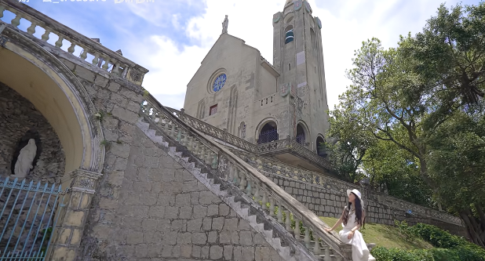

主教山小堂，又名海崖圣母小堂，位于澳门半岛西望洋山顶，始建于1622年。建造这座教堂的原因是由于当时执行去日本航线的葡萄牙航海者在海上与荷兰海盗船相遇，却未受伤害，深信是神灵保佑，许下建堂诺言以谢神思。主体建筑包含三角形屋顶圣母塑像、钟楼及1935年增建的主教府，前方平台设大理石圣母像，下方路德圣母岩洞内立有象征法国路德城显灵场景的圣母像。

该教堂曾于1835年重建扩大规模，1892年附近古堡拆除后逐步形成现有格局。哥德式教堂尖顶被评定为“具建筑艺术价值之建筑物”并收录于《澳门文物名录》。每年圣母花地玛巡游从圣母玫瑰堂出发至此举行露天弥撒。周边汇集圣斯定堂、圣若瑟修院等历史建筑，可俯瞰南西湾及珠海湾仔风光

# 建筑规模

主教山小堂于1622年建于炮台旁，殿堂简朴，山径迂回，供在澳葡兵弥撒祈祷之用。

1892年附近古堡拆除后，圣母堂得以逐步扩大，1835年重建后成为今天宏伟之规模。教堂建筑以高耸的门楼为主体，三角形的屋顶上站立着圣母塑像，教堂右则为钟楼，钟楼高耸入云，十分庄严肃穆。教堂左则为1935年加建的主教府。

教堂前是一片宽广平台，平台尽处竖立一尊大理石雕刻而成的圣母像，圣母双手合十，貌甚慈祥，面临大海。平台下有一路德圣母岩洞，循左右环抱之石阶而下，即达洞前。

洞内岩石嶙峋，中开拱门，内立圣母像，象征古时圣母在法国路德城内，当众显灵的情景。

其间正置祭坛，洞前有铁栅围绕，地上设有多排低矮的长石板，供教徒跪拜，忏悔。

路德圣母岩洞前，空阶上有一块刻有葡文的古铜墓碑，是二十世纪初天主教澳门主教埋骨之处。1918年2月18日，约翰鲍连那主教逝世，寄葬于此。

教堂四周花径通幽，古树浓荫，建筑端丽，环境优美，更可居高临下，环视南西湾和中国大陆珠海市湾仔的风光，成为中外游客喜到的热门观光点之一。

每年圣母花地玛出游从圣母玫瑰堂出发，最后到达主教山小堂，圣母像由一身素白的妇女们抬著走在队伍的前列，而队伍中三名儿童的衣著打扮就像当年在花地玛看见圣母显灵的孩子一样。

上百名的信徒沿途唱圣诗、念祷文跟随。巡游每年从圣母玫瑰堂出发到主教山上的圣母小教堂，并在此举行露天弥撒。