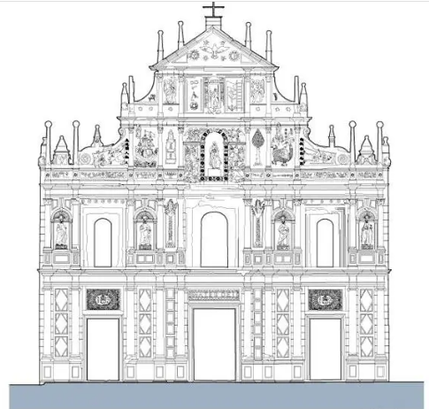

# 简介

大三巴牌坊是圣保禄大教堂的前壁遗址。圣保禄教堂附属于圣保禄学院，学院于 1594 年成立，教堂则于 1602 年开始动工，1637 年修建完成。1762 年，圣保禄学院因葡萄牙王室驱逐耶稣会士而关闭。1835 年，教堂因火灾被烧毁，仅剩下正面前壁、大部分地基和教堂前的石阶，这就是如今的大三巴牌坊。1990 年至 1996 年间，澳门政府对遗址进行了考古和修复，并围绕遗址建成了一个天主教艺术博物馆。

“三巴”是葡文“圣保禄”（São Paulo）的译音，前冠以“大”字，用于区别另一座小三巴教堂，本地人因教堂前壁形似中国传统牌坊，将之称为“大三巴牌坊” 。大三巴牌坊的建筑设计采用意大利巴洛克风格，而其中雕刻又具有东方特色。

# 建筑特色

大三巴牌坊融合了东西方建筑艺术的精华，建筑风格为巴洛克式，但部分雕塑和元素设计具有浓烈的东方色彩，如中文字或菊花图案等，又称 “立体的圣经”。

大三巴牌坊造型为意大利教堂式样，与西班牙型接近，属于文艺复兴时期的建筑特色。它是在耶稣会建筑艺术的基础上修建的，是耶稣会基督教艺术在远东发展的结晶。从建筑史学上来看，属于文艺复兴建筑式样和巴洛克建筑式样的混合体。大三巴牌坊整体以花岗岩建成，宽23米，高25.5米，上下可分为五层，自第三层起往上逐步收分至顶部则是一底边宽为8.5米的三角形山花；顶层两侧分别雕有太阳、月亮、星辰，最顶上立着一个象征天主教的十字架。其余几层也分别镶嵌、雕刻着一些形态各异的基督教艺术群像，立有圣徒塑像、圣婴雕像以及圣母像，并用40多根圆石柱装饰。同时，由于教堂是由意大利籍的耶稣会神父设计、日本天主教徒工匠协助建造，使得教堂融入了许多东方建筑的元素，例如中国的石狮、汉字以及日本的菊花雕刻等元素。

## 第一层

大三巴牌坊第一层有三道入口，并有十枝爱奥尼柱式支撑及装饰墙面，大门两侧各三支，侧门一边各两支；正中间的主门门楣上写有拉丁文“MATER DEI”，意为“天主圣母”，表示教堂供奉的是圣母玛利亚；两侧的门楣则是由字母组成的“I”“H”“S”图案，是拉丁文“Jesus Hominum Salvator”的简写，意为“耶稣是人类的救主”，也是耶稣会的标志

## 第二层

第二层的主题是“使徒的使命”，四周分立了四个耶稣会圣徒的塑像，最初这些塑像是镀金的，面孔与手均涂成红色，但如今已不复存在。这些塑像从左至右分别是耶稣会第三任会长博尔吉亚、罗耀拉、沙勿略、青年学生主保贡萨格，每个铜像的底座均有代表其名字的字母。墙壁则由十枝科林斯柱式及三个窗口组成，窗楣上均有七朵玫瑰花浮雕装饰，中间窗口侧两柱间以棕榄树装饰，侧窗洞两边柱间对称设有壁龛，分别置有四位天主教圣人的铜像。

## 第三层

第三层是装饰最丰富的一层，其主题是“圣母的慈爱”，墙中央设有一深凹的拱形壁龛安放了一座圣母玛利亚的铜像，两侧各有三个天使浮雕；此外，中央共有六枝混合式壁柱，两侧以方尖柱代替壁柱，是下面两层柱体的延续，各柱间均以浅浮雕装饰缀以七头龙；璧柱左侧是智慧之树和一只七头怪兽，其上有一圣母浮雕，侧有中文“圣母踏龙头”字样，而右边对称位置上则是精神之泉及一只西式帆船，上有海星圣母浮雕。在柱组外边是一涡卷，右边是一骷髅及中文字“念死者无为罪”； 左边则是一魔鬼浮雕，中文则是“鬼是诱人为恶”，此层最外侧两块墙身有两条带有圆顶之方尖柱，而墙侧则设有中国舞狮造型的滴水狮子。

## 第四层

第四层的主题是“人类的救赎”，中间是耶稣圣龛，两侧有耶稣受难的刑具浮雕，往外由四枝混合式壁柱组成，柱间用天使浅浮雕点缀，柱两边有弧形山墙。

## 第五层

第五层的主题是“天主创造宇宙”，以鸽子代表的“圣灵”位于三角楣中央，周围刻有象征天际的太阳、月亮和星星。此外，楣顶还有一枚铁质的天主教信仰标志的十字架。

# 文化和历史意义

大三巴牌坊位列 “澳门八景” 之首，2005 年，它与 “澳门历史城区” 的其他 21 栋建筑物文物被列入《世界遗产名录》，是澳门东西方文化交融的产物，反映着天主教的信仰，也见证了澳门的历史变迁。

大三巴的历史意义核心在于见证澳门 400 多年东西方文化交融的历程，是天主教在东亚传播的重要遗址，也是澳门从殖民贸易港口到多元文化城市的历史缩影；其背后的故事则围绕教堂兴建、教育发展与灾难留存展开，充满时代印记。

## 核心历史意义：东西方交融的 “活化石”

- 天主教在东亚的早期传播地标

    大三巴的前身 “圣保禄大教堂”，是 16 世纪末至 17 世纪天主教耶稣会在东亚的核心教堂之一。当时耶稣会士以澳门为基地，将天主教传播至中国内地、日本、越南等地区，教堂既是宗教活动中心，也是传教士的 “中转站”—— 比如明末清初的著名传教士利玛窦，就曾在圣保禄学院（与教堂同属耶稣会）学习汉语和中国文化，再前往内地传教。它的存在，标志着天主教文化首次大规模与东方文明（尤其是中华文明）碰撞与融合。

- 澳门 “贸易 + 宗教 + 教育” 殖民历史的见证

    16 世纪中叶澳门成为葡萄牙租居地后，迅速成为远东重要的贸易港口。圣保禄大教堂与附属的 “圣保禄学院”（1594 年成立，东亚第一所西式大学）同步兴建，学院不仅教授宗教知识，还开设天文、数学、医学、汉语等课程，培养了大量熟悉东西方文化的人才。这种 “贸易支撑宗教，宗教带动教育” 的模式，正是澳门早期殖民历史的典型特征，而大三巴作为遗址，留存了这一特殊历史阶段的痕迹。

- 世界文化遗产的 “澳门符号”

    2005 年，大三巴随 “澳门历史城区” 列入《世界遗产名录》，其入选核心原因是：它以巴洛克式西方建筑风格为主体，却融入了大量东方元素（如牌坊上的中文 “圣母”“耶稣” 字样、菊花图案、中式狮子浮雕），是 “西方宗教文化与东方本土文化结合的罕见范例”，成为澳门多元文化身份的核心象征。

## 背后的关键故事：从 “东方最美教堂” 到 “遗址牌坊”

- 耗时 35 年的 “东方奇观” 兴建（1602-1637）

    圣保禄大教堂并非一次建成：1580 年最初的木质教堂被大火烧毁后，耶稣会于 1602 年启动重建，因工程复杂（需从葡萄牙、意大利运来建筑材料，由葡籍工匠与中国工匠共同施工），耗时 35 年才完工。建成后的教堂规模宏大，拥有华丽的祭坛、彩色玻璃和镀金装饰，被当时的传教士称为 “东方最美的天主教堂”，是澳门的地标性建筑。

- 学院关闭与教堂的 “衰落伏笔”（1762 年）

    18 世纪中期，葡萄牙王室因忌惮耶稣会的影响力，下令在全国及海外殖民地驱逐耶稣会士。1762 年，圣保禄学院被迫关闭，教堂失去了主要的维护力量，逐渐走向破败 —— 这为后来的彻底损毁埋下隐患。

- 两场大火：从完整教堂到 “仅存前壁”（1835 年）

    1835 年 1 月 26 日，教堂附近的华人店铺意外失火，火势迅速蔓延至教堂木质结构部分。由于当时澳门缺乏有效的灭火设施，加上教堂年久失修，大火烧毁了教堂的穹顶、大殿、钟楼等所有部分，最终仅剩下由花岗岩建造的正面前壁（即如今的大三巴牌坊）和部分地基。火灾后，澳门民众因 “圣保禄” 的葡萄牙语 “San Paulo” 发音近似 “三巴”，且牌坊是 “第三座” 圣保禄教堂的遗址（前两座均被毁），便称其为 “大三巴牌坊”，名字沿用至今。

- 从 “废墟” 到 “文化地标” 的重生（20 世纪至今）

    大火后的近百年里，大三巴牌坊曾一度被当作 “废墟”，甚至有人提议拆除。直到 20 世纪后期，澳门政府意识到其历史价值，1990-1996 年对遗址进行考古修复，清理出教堂地基、墓室（曾埋葬早期传教士和葡籍贵族），并在牌坊后方建成 “天主教艺术博物馆”，展示教堂遗留的宗教文物。如今，它不仅是澳门游客量最高的景点，更是澳门人对 “多元历史” 的集体记忆载体。

## 音乐会

