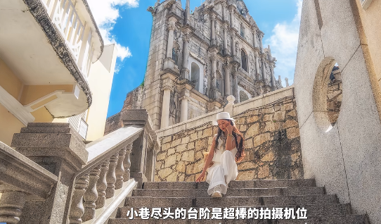

澳门恋爱巷（Travessa da Paixão）是澳门半岛中心地带的旅游景点，坐落于大三巴街与大三巴右街之间，全长约50米，历史逾80年。其葡文名称“Paixão”原意为迷恋与激情，另有说法与宗教热情相关。巷内建筑以葡萄牙风格为主，第5至11号楼房采用红黄相间色调，第13号建筑融合新古典主义与现代主义元素，沿街可见薄荷绿窗框与心形涂鸦墙。

作为影视作品《伊丽莎白》《游龙戏凤》的取景地及婚纱摄影热门场所，巷内设有文艺小店与咖啡馆，邻近大三巴牌坊的地理位置使其成为游客聚集地。民间相传途经此巷者易遇恋情，故被视为情侣互动场所。

据说走在这里的人会遇到心爱人

