充电宝，牛肉干、面包，饮料。雨伞，水杯接水，坐垫，小风扇。

鲸鲨馆  白鲸馆  海底互动船  极地转转  企鹅馆  碰碰车   海豚表演   海豚表演   海豚表演   烟火秀

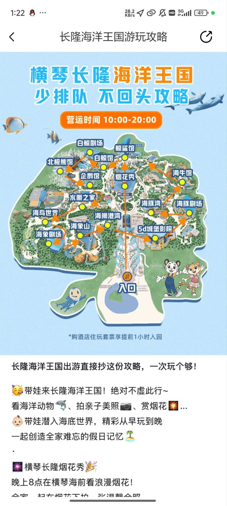

# 鲸鲨馆

鲸鲨馆：

长 40m，高 8.3m的亚克力幕墙

长廊

餐厅

独立缸体

喂得很肥。

## 鲸鲨

鲸鲨是世界上最大的鱼。鲸鱼是哺乳动物，所以鲸鱼不在排行榜里。现在禁止人工捕捞鲸鲨。所以长隆这几条，也是且看且珍惜。因为它们的寿命很长，可以活到80~130岁，虽说是鲨鱼啊，嘴巴也很大，但实际上这个家伙是滤食性动物，以浮游生物和小鱼为食，不会对人类构成任何威胁。

鳍被做成天九翅。

## 阿氏前口蝠鲼

内地唯一一条人工饲养的 阿氏前口蝠鲼：魔鬼鱼。是世界第二大蝠鲼，通常体长3.5m，长隆这条算大的。

蝠鲼特点：头部的两个角是胸鳍分化出来的头鳍。

滤食性。吃东西的时候呢，会展两个头鳍将食物送进嘴里啊，说白了就是这两个鳍实际上相当于自带了两个勺子，方便把吃的东西往嘴里扒拉。

蝠鲼们呢还会一起聚餐，成群捕获浮游生物和小鱼，数量多的时候啊，还会形成蝠鲼龙卷风这样的奇观。

体积较小的芒基蝠鲼还挺喜欢飞的，使得它们可以跃出水面4米之高

它们可能还是地球上最聪明的鱼之一，它的大脑占比所有鱼类中最大的，达到了自身体重的0.7%。所以它也是为数不多能通过镜子测试的鱼。

鳃被做成药材，彭鱼鳃。但是其实有毒，害人又害鱼。

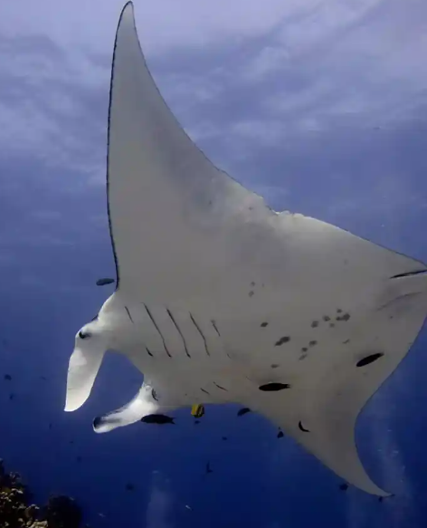

## 路氏双髻鲨

世界上最大的圈养路氏双髻鲨种群。一般就2条，长隆养了20条。把一个家族弄过来了

双髻鲨 双髻提供360度视野，转弯稳定性，提升特殊器官劳伦氏壶腹的面积，搜电信号 

路氏双髻鲨相比于双髻鲨头中间和两侧都有凹陷。

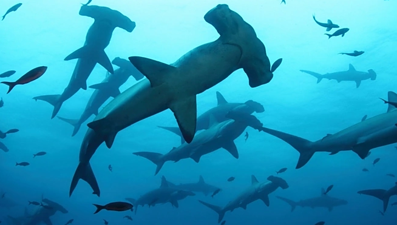

## 沙虎鲨

锥齿鲨

100多万一条。鲨鱼里唯一可以通过吞空气控制自己悬浮的鲨鱼

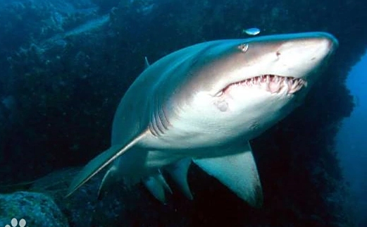

## 铅灰真鲨

背鳍高耸

## 尖吻犁头鳐

方便钻入泥沙。犁头鳐濒危物种。

世界首例成功繁育澳洲尖吻犁头鳐的海洋馆。

## 圆犁头鳐

前半鳐鱼，后半鲨鱼。

平时栖于海床的泥沙上，用嗅觉找出猎物，然后就会以它宽大的头部和他的胸鳍，把猎物逼向海床，用身体底部的嘴巴把它吃掉。

## 神像（镰鱼）

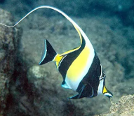

群居鱼类，如果达不到一定的群落数量，就会神经紧张，不吃东西，郁郁而终。纯鱼缸也会让它们郁郁而终，礁岩生态水族箱还行。

在群里里也会有战争，特别是一开始的时候，它们互相地追逐撕咬，别看它们嘴小，牙齿十分锋利，经常会造成遍体鳞伤。最终会有一个首领出现，首领可以维持群体中的平衡。通常个头适中，鳍最完整的个体占有绝对优势。

如果将首领捞出，整个群落就会陷入恐慌中，可能几天不进食。

## 玻璃鱼

蓝加双边鱼。玻璃鱼体长5-7厘米。全身透明、鱼骨和内脏清晰可见。眼睛很大。背鳍呈双峰。

## 刀片鱼（条纹虾鱼）

由于刀片鱼全身包裹在透明的骨质鳞甲中，以致身体僵硬笔直，不能像其他鱼类那样扭动身体或摇摆尾巴来游泳。为了减轻游泳阻力，避免被迅猛的海流带走，它们在将身体进化成薄如刀片的同时，又摸索出了特殊的生存方式：在浅海中集群游动，大部分时间里，刀片鱼都以嘴朝下、尾朝上、背向前的姿势随波漂游，靠小而薄的腹鳍摆动来改变方向，如同倒立在水中进行花样游泳一般，形成一道独特的海洋景观

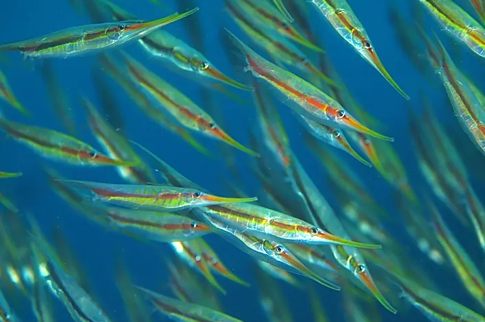

## 哈吉鳗（哈氏异康吉鳗）

该物种常群体栖息，将身体埋入沙中仅露出头部摄食，遇惊扰即刻缩回洞穴。觅食时朝向水流摆动身体过滤浮游动物，具有拟态海草的独特行为。繁殖期雌雄个体通过缠绕完成体外受精，受精卵随水流发育后沉降到沙床

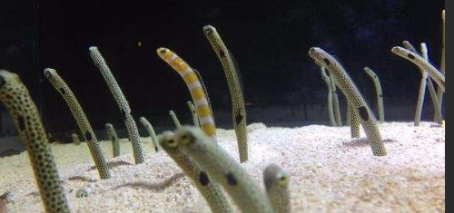

## 白条双锯鱼

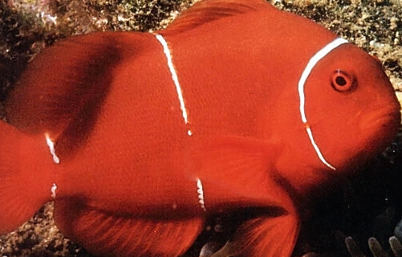

## 黄火箭鱼

别称黄镊口鱼，为蝶鱼科动物，属典型珊瑚礁区鱼类。

吻部呈管状前突，头部呈三角形，眼睛至头顶为灰褐色并藏于黑带中。体色鲜黄，尾鳍银白，其余各鳍鲜黄色，臀鳍末端具黑色圆斑。

善于用尖吻捕食岩缝底栖生物，适应环境后可在纯养鱼缸中长期存活，配对个体可形成终身伴侣关系。坚持一夫一妻制，纯爱鱼。

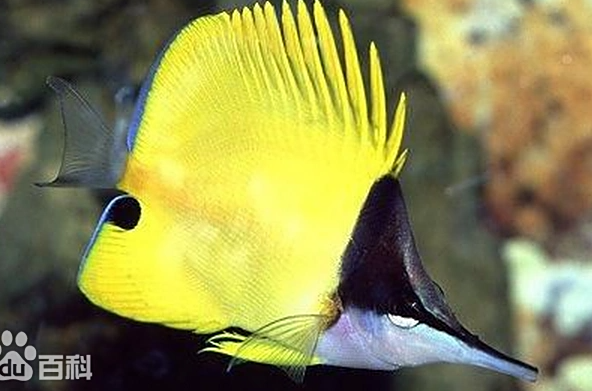

## 紫海金鱼静拟花鮨

分布于西太平洋珊瑚礁海域的硬骨鱼类，隶属于辐鳍鱼纲鲈形目鮨科。

该物种通常栖息在10-100米深水域，形成以小鱼、雌鱼、雄鱼构成的分层社会结构，具有杂食性特征，主要摄食浮游生物和甲壳类。

其繁殖体系为一夫多妻制，并具备雌性向雄性转变的性逆转特性。因独特的粉紫色外观与优雅游姿，被广泛认为是重要的海洋观赏鱼种。

## 黑带棘鳞鱼

金鳞鱼科。俗称 金鳞甲、将军甲、铁甲兵

## 尖吻棘鳞鱼

金鳞鱼科。

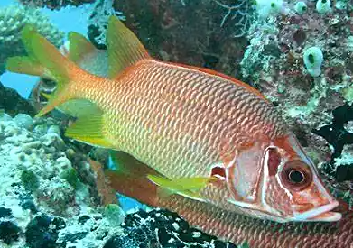

## 大眼仔

金鳞鱼科。巨鳞鱼

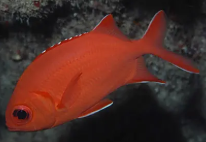

## 裸胸鳝

该属鱼类栖息于热带及亚热带海域的珊瑚礁区，水深9-110米，常藏身岩缝或洞穴。捕食时利用咽颌拖拽猎物，尾部可打结辅助撕咬，能捕食刺鲀等猎物。部分种类体内含毒素，中国台湾曾发生误食中毒事件

## 朝天水母（雪花水母）

朝天水母是一种具有特殊生态行为的刺胞动物，其伞状体呈圆盘状且表面带有车轮状图案。

该物种以触手朝上的倒立姿态栖息于浅海区域，已获得更多的光，通过与虫黄藻光合作用共生获取能量，主要分布在热带至亚热带海域的潟湖、潮间带等环境中。该水母的刺丝胞毒性较弱，但在接触时仍需保持谨慎

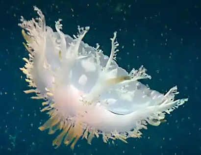

## 太平洋黄金水母

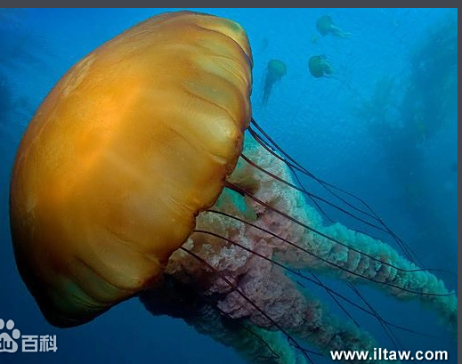

属名"Chrysaora"源自希腊神话中海神波塞冬之子克律萨俄尔（Chrysaor），意为"持有黄金武器者"，种加词"fuscescens"在拉丁语中表示"从暗色变为明亮"，共同体现其体色特征与生物发光能力

# 海豚岛

茅草屋栈道视角

往下走亚克力幕墙

## 太平洋斑纹海豚

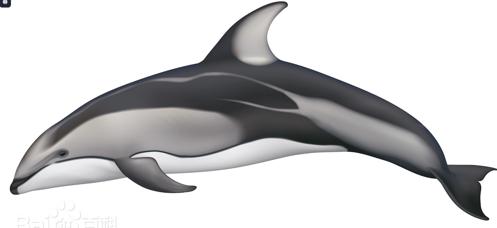

## 中华白海豚

国家一级保护动物，也会出现在淡水上。

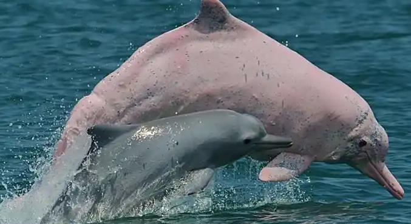

# 企鹅馆

企鹅隧道，企鹅骨骼，企鹅模型

## 阿德利企鹅

住在最南边，问你充不充Q币的那只。

为啥叫 阿德利 因为它发现者的老婆就叫 阿德利。

熊猫属于是白点黑眼圈，它是黑脸白眼圈

小时候呢就是个煤球，长大后呢好点，下半身呢就变成雪白色了

速度快，风骚走位。

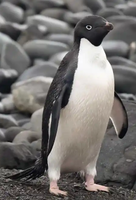

## 帽带企鹅

栖息于南太平洋和南极大陆附近的企鹅。

在繁殖季节为了保持警觉呢，每次睡觉平均只睡四秒，但睡的次数多呀，每天呢能睡超过1万次，所以累积起来就达到11个小时了，这种短时间的睡眠呢被称为微睡眠。

另外我不太确定是不是因为经常睡不好，导致他们压力大。帽带企鹅也是被普遍认为是最具攻击性，脾气最暴躁的企鹅种类。

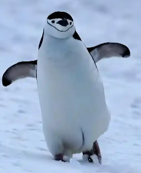

## 巴布亚企鹅

为眼睛上方的白色羽毛呀，也叫白眉企鹅。 一只才 30-40万。

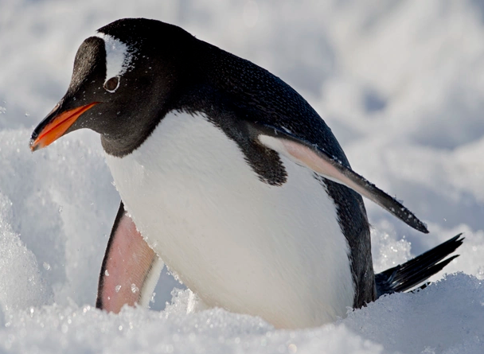

## 帝企鹅

100多万一只。（为啥这么多，自己繁育的）最大 120cm 高 46KG

## 王企鹅

和帝企鹅很像 区别是 花纹连续不断开 而帝企鹅断开。

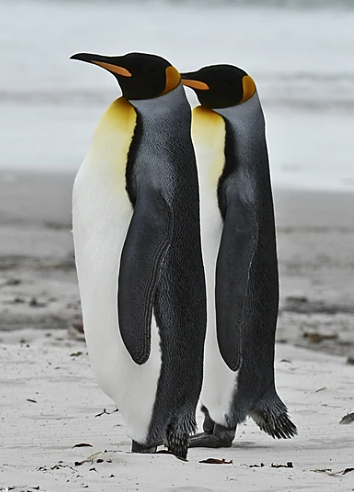

## 崖海鸦

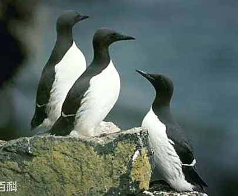

经常可见成群的海鸦在海面上飞翔。但是其翅膀最大负荷仅为2 g/平方厘米，表明其翅膀不够灵活，造成起飞困难。在第一次换毛后45-60天内，海鸦无法飞翔。

它们更擅长潜水，一般情况下可潜到水下30-60米，最大记录是水下180米。

## 海鹦

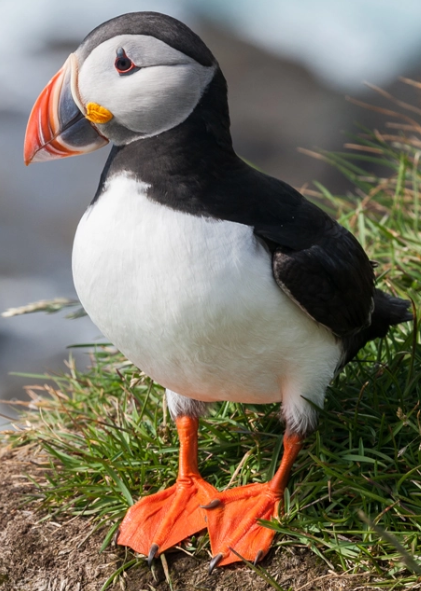

繁殖期颜色才鲜艳。

## 企鹅隧道

## 企鹅骨骼

## 企鹅模型

### 豹海豹

给你这是我的QQ

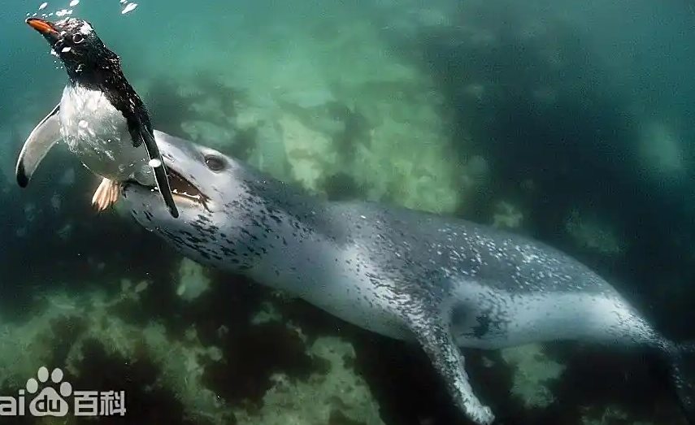

# 白鲸馆

一刻不停的讲解员。动物表演。螃蟹展缸。

## 动物表演

有些马戏团表演不支持，白鲸驼人啥的。

## 甘氏巨螯蟹

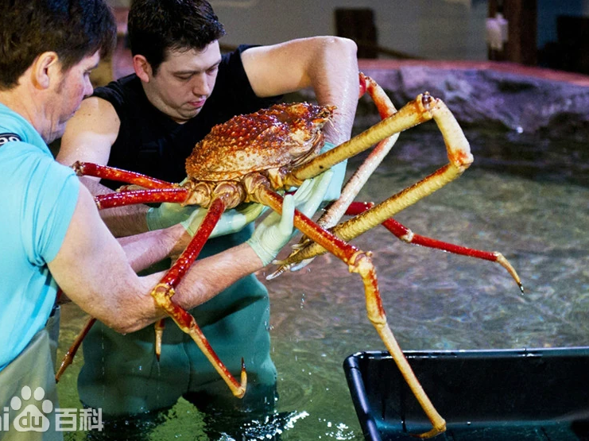

## 美洲螯龙虾

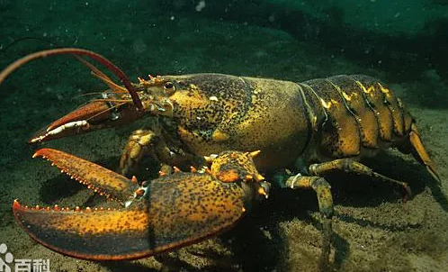

真正的龙虾没有钳子的。而是龙须。

## 巨大拟滨蟹

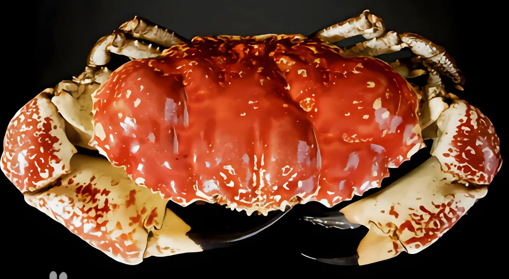

皇帝蟹

# 北极熊馆

广州长隆的比较好。这里的太空旷太小

## 海象

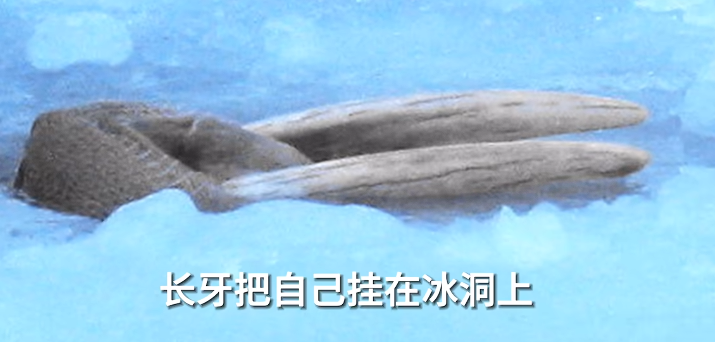

# 海鸟世界

没笼子，从小在这里，也不会跑。