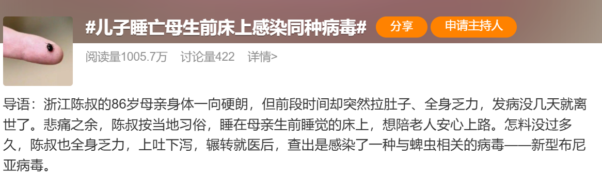
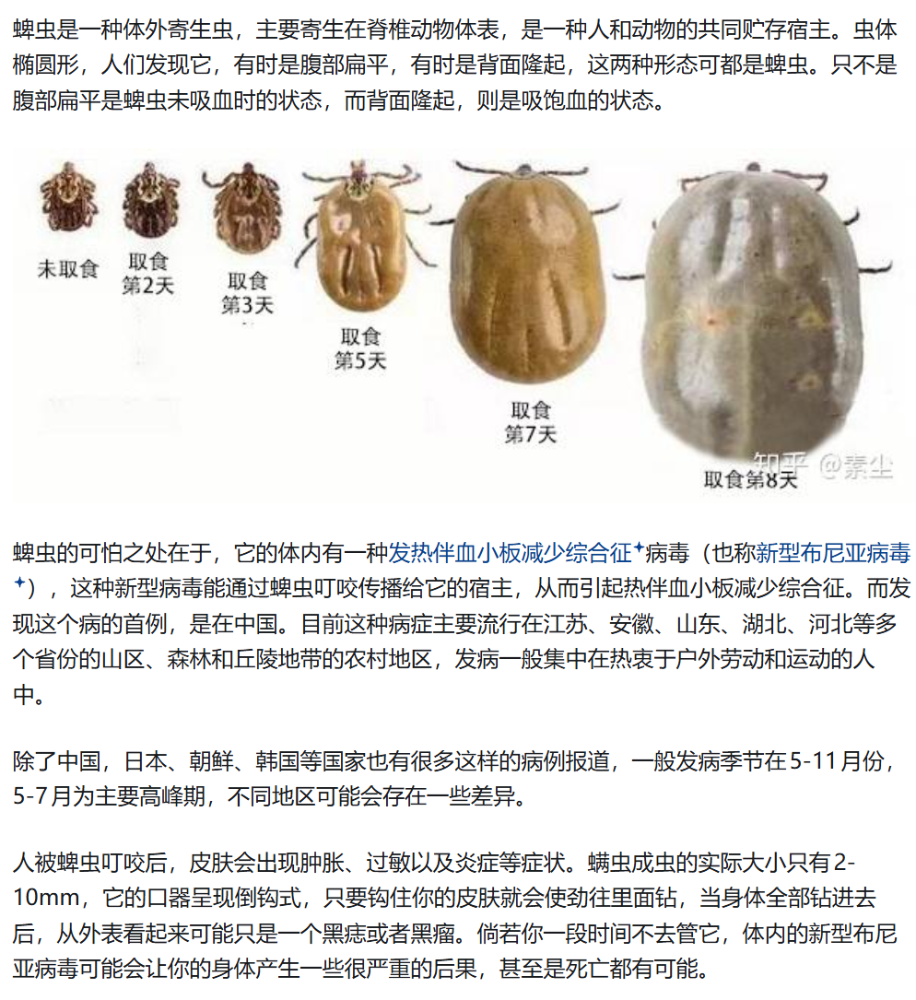

被蜱虫叮咬后，可以按照以下步骤处理:

- 不要强行拔出：切勿用手直接拔出蜱虫，以免将蜱虫的头部留在皮肤内，增加感染风险。 

- 使用工具移除：可以用酒精涂抹蜱虫，待其放松后，用镊子夹住蜱虫的头部，缓慢向上拔出。 

- 保留蜱虫尸体：将蜱虫放到塑封袋中，保存，便于后续就医评断病原体。

- 清洁与消毒：移除蜱虫后，用肥皂水清洁叮咬部位，并用酒精或碘伏进行消毒。 

- 观察症状：密切关注叮咬部位的变化，如出现红肿、发热等症状，应及时就医。 

- 预防措施：在户外活动时，尽量穿长衣长裤，回家后及时检查身体和衣物，防止蜱虫附着。 
