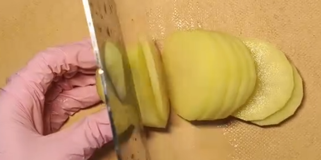

# 家常豆瓣酱做法 快速 节省

- 土豆
- 蒜片，小葱段，干辣椒（灵魂捏，辣辣的吃土豆的边非常好吃）
- 豆瓣酱

1. 土豆建议以短的一侧作为切片侧，切大概一元硬币厚度，清水洗去表面淀粉，控干水份再加入淀粉涂满。
2. 控干水分期间可以准备蒜片、小葱段、干辣椒（去籽），将这些放到一个小碗里
3. 油温大火烧适量油，油温到木筷子起泡泡就下土豆进去慢火煎炸（油多就炸，不然就煎）（多炸一会儿哦）
4. 盛出多余油，锅中剩余适量油，将小碗调料爆香，爆香之后加入适量豆瓣酱继续爆香
5. 最后加入土豆片进行翻炒即可

