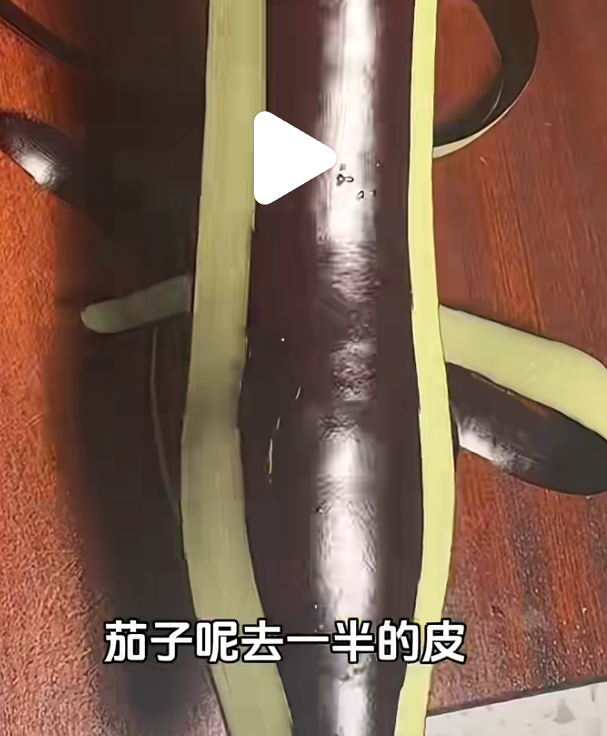

茄子，土豆，辣椒（青红椒）
淀粉、盐、糖、酱油、花椒、鸡精、水

- 茄子，土豆，辣椒 滚刀
- 茄子泡水（加入半勺醋）（也可以不泡水），然后挤干水分，过一遍淀粉
- 土豆热水烫一下（不烫的话要洗洗，主要是为了去除过多的土豆淀粉），然后放到滤网控干水分
- 淀粉、盐、糖、酱油、花椒、鸡精、水的汁

宽油炸茄子（）土豆（7成火，5分钟左右，金黄酥脆）和
重新起锅，稍微加一点点油
茄子土豆辣椒一起炒！加料汁！炒！OK！

细节：茄子可以去一半皮，这样滚刀切好之后，更容易炸熟并且淀粉裹住的面积大，口感更好。

