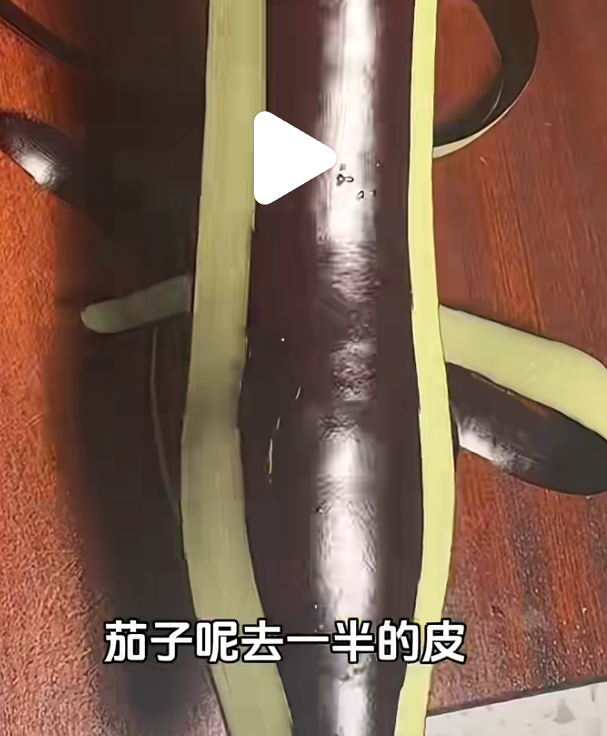
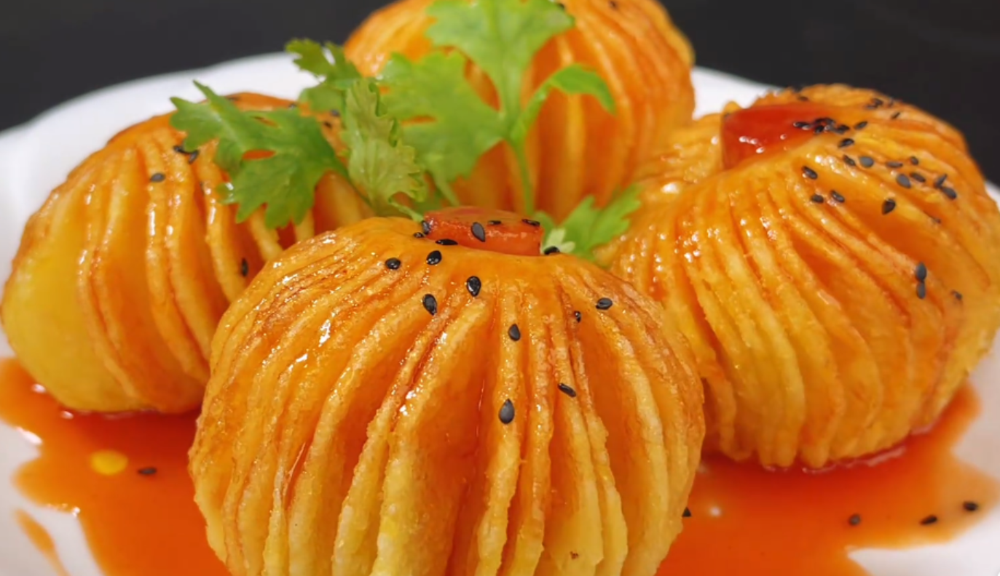

# 地三鲜

茄子，土豆，辣椒（青红椒）
淀粉、盐、糖、酱油、花椒、鸡精、水

- 茄子，土豆，辣椒 滚刀
- 茄子泡水（加入半勺醋）（也可以不泡水），然后挤干水分，过一遍淀粉
- 土豆热水烫一下（不烫的话要洗洗，主要是为了去除过多的土豆淀粉），然后放到滤网控干水分
- 淀粉、盐、糖、酱油、花椒、鸡精、水的汁

宽油炸茄子（）土豆（7成火，5分钟左右，金黄酥脆）和
重新起锅，稍微加一点点油
茄子土豆辣椒一起炒！加料汁！炒！OK！

细节：茄子可以去一半皮，这样滚刀切好之后，更容易炸熟并且淀粉裹住的面积大，口感更好。

# 红烧茄子

非油炸作法：茄子，葱蒜。

- 滚刀切茄子，尽量切小块，这样容易熟。切好用适量盐腌制10分钟。
- 生抽、老抽、蚝油、白糖、盐、淀粉、清水（这里突出一个适量、少放，后面可以补盐）
- 切葱蒜备用
- 攥干茄子水份，加淀粉搅拌备用

- 油热加茄子，中大火炒至表面焦黄，加入蒜沫
- 炒出蒜沫香味，加入料汁
- 大火收汁，加入葱花，结束

# 蒜蓉茄子

茄子洗净切两头。
切蒜和香菜（可以看喜好加一些其他菜，比如辣椒。。。）。
酱油、盐、味素（看喜好可以加醋、糖、香油）调汁。

锅中放油，茄子下锅，中小火煎制，2、3分钟翻转，茄子熟后用筷子分隔
加入辅料和料汁，OK！

# 青椒土豆丝

土豆切丝，清水浸泡防止变色。
青椒切丝，蒜切片。
土豆丝这时候淘洗一下，洗去淀粉，一方面防止粘锅，一方面炒出来的更加清脆。然后放到滤网滤水分。

大火，油热放入蒜片，1、2秒后放入土豆丝，再放入青椒丝，大火慢炒。
土豆丝炒差不多透明，稍微调小一点火候，开始放入老三样，盐味精鸡精，翻炒几下出锅。

# 炸土豆手榴弹

选用大长的土豆，火腿肠
黑芝麻，蔬菜

土豆去皮从中间切开，一分为二。把两头分别修整一下去掉不要。土豆两侧垫上筷子，切成厚度适当的薄片。
土豆涂盐，杀出水分，软化土豆。
浸泡十几分钟，盐水浸泡会使土豆变得有韧性。
把水倒掉，清水洗几遍，洗掉盐味。
上玉米淀粉，防止粘连，炸得酥脆。
土豆中间放火腿肠，用牙签固定土豆。

番茄沙司 + 白醋 + 白糖 + 毛毛盐 + 清水

宽油烧热，中火炸2分钟定型，然后用筷子搅动。
小底油，加料汁，熬至粘稠
浇汁，撒芝，放菜，完活

