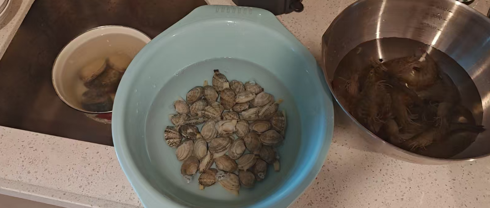
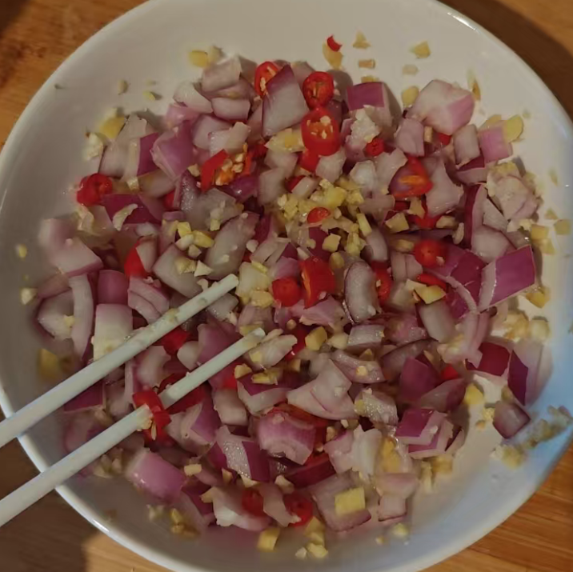
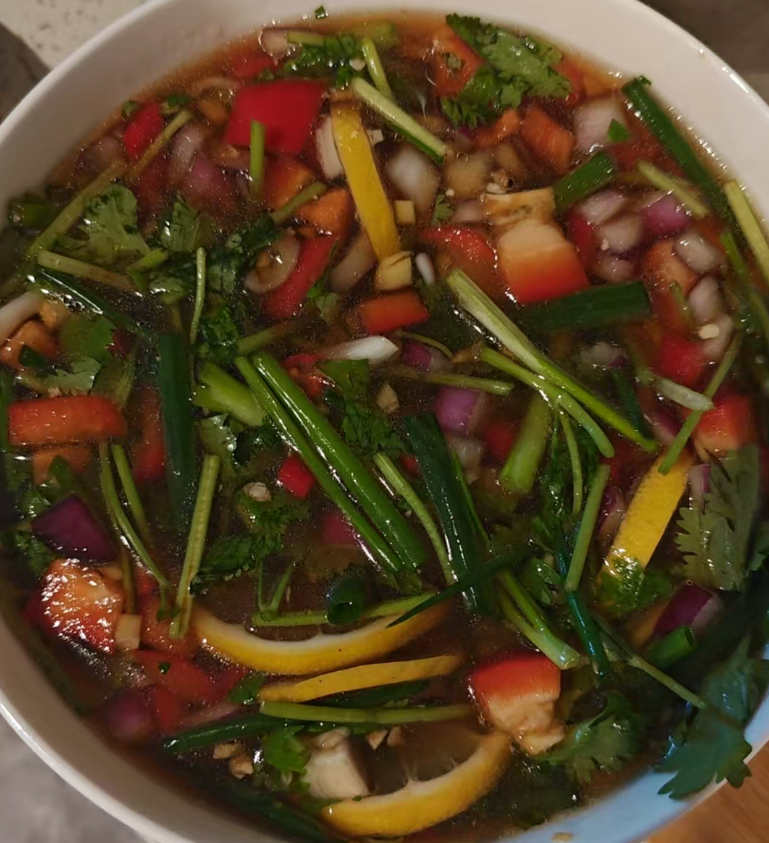
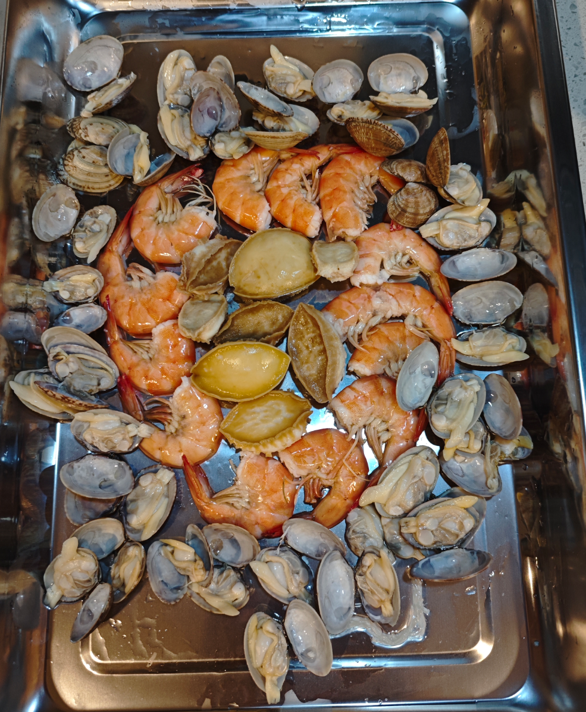
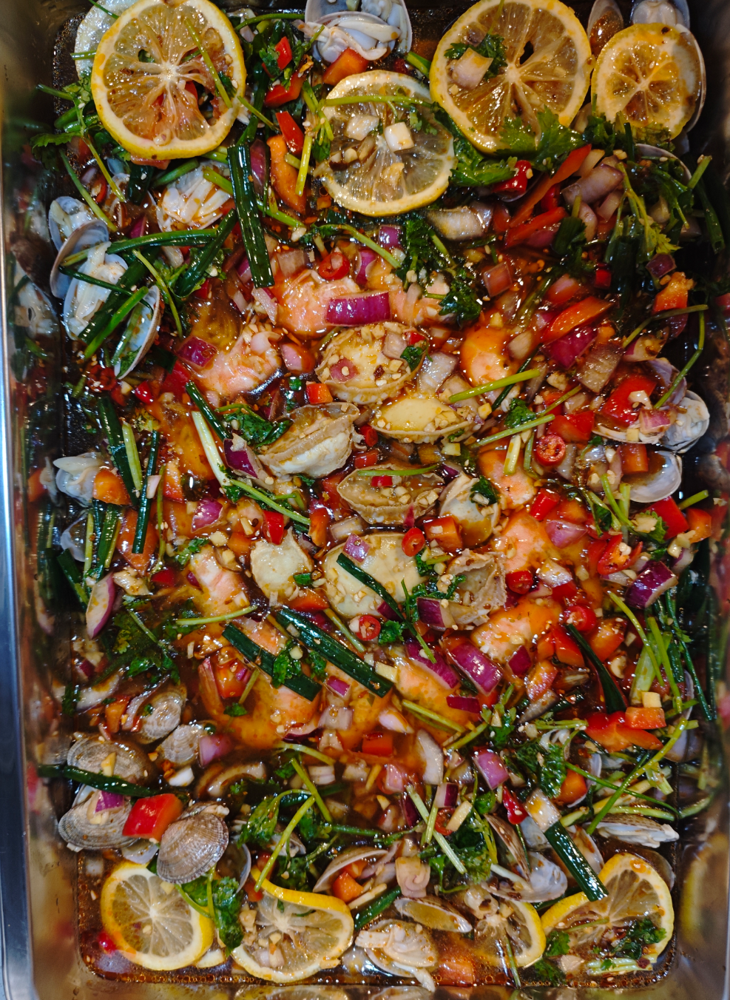

#### 孜然羊肉
1：生姜、大葱、黄酒放在一起打碎成葱姜汁。可以用来腌肉腌鱼去腥。
2：食用盐、胡椒粉、孜然粉、生抽酱油

# 捞汁海鲜

没有什么固定的搭配，喜欢吃什么，就从市场买回来什么。

有些人第一步先把海鲜焯水了，这可不对。

## 先做捞汁（两人份）

洋葱1/4切成碎丁，小米辣3根，切成碎丁，姜末10g，蒜末10g

然后加白砂糖15g。（渗透压功能）让刚刚的调料素材“出汗”。

切红椒块配色，香菜段提味道，小葱拍扁切小段，柠檬（2人用半个柠檬就好）切片去籽。 这些适量就好。少加，不要抢了料

然后放调味汁：耗油10g，鱼露10ml，生抽25ml，美极鲜15ml，花椒油15ml，香油10ml，芥末油5ml，水1瓶（180ml，这个不要太多会稀释的，我用的300太淡了不浓稠了）

最后加入适量辣椒油。

弄完这些就可以静置让食材释放其本身味道。

## 准备海鲜

### 海鲜焯水

水里加入大段葱姜，花雕酒 30 ml，盐 6g。

海鲜分批下锅，因为食材成熟时间不同，所以分开算时间去焯水。

注意这锅水适量焯，一般焯两种海鲜就应该重新换水。

鲍鱼三分钟。

## 制作记录

8 头鲍鱼 6.8 一个
15 头鲍鱼 3.8 一个

鲍鱼用温水泡，

“几头鲍” 的意思是，1斤（605克）有几个大小一致的干鲍。

约30只花甲 6.48  

基围虾  14只 17.64

柠檬 8 元

洋葱半个 6 毛

# 锅包肉

姜丝 葱丝（葱白丝） 胡萝卜丝 香菜段（中间梗部分，带少量叶子） 蒜片

泡淀粉，暂时1：1，不要搅拌，就让他沉降

把里脊肉切成 3 毫米左右薄肉片(切大点片)（筷子头的厚度）用刀背拍打散 ，加盐，胡椒粉，葱姜水一点点，抓拌均匀，腌制 10 分钟

白糖适量，9度白米醋，少来点老抽提色（后面炒的时候用）

淀粉泡好把水倒出来，然后放到腌制的肉里，再回加一点点泡淀粉的水，轻一点抓板均匀，然后放上点大豆油（会更黄酥），防止炸的时候崩裂，再次轻抓均匀。（要轻，不用抓得太细，不然会硬）

热油，拿起一片肉，蹭蹭淀粉，然后在锅里下一点，再往前一推。

炸完一遍，捞出，等油热再复炸，重复3次，将油装出来，不用刷锅

葱姜蒜放锅里热一下，然后放肉和其他配菜。

