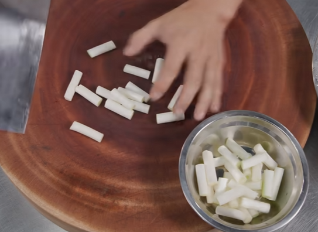
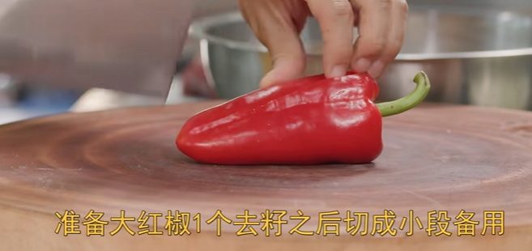
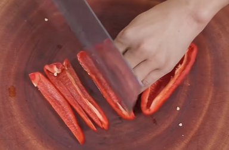
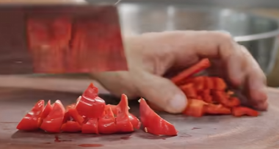
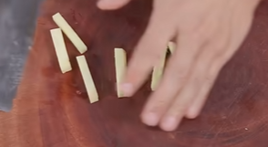

[王刚爆牛肉](https://www.bilibili.com/video/BV1ih411R7Zx/?vd_source=386bdb94ff2a430f8d22a6de9755030c)

# 食材

外里脊肉 350g

大葱 120g

大红椒一个

# 备菜

在准备牛肉时，先将其切成厚片（8mm）并用刀背敲散（横竖兼备），这样能够让牛肉更容易入味，提升口感。然后切成小条，切好的牛肉还需清洗去除血水，以减少腥味。

- 玉米淀粉  2g
- 耗油  3g
- 生抽酱油 3g
- 食用盐 0.2g
- 老抽 3g
- 玉米淀粉 15g
- 清水 15g

搅拌均匀下入牛肉，朝一个方向搅拌均匀。最后加入适量植物油将牛肉封口（油就可以）

# 刀工

大葱切成小段。

大红椒去籽切小段

生姜切小段

大蒜切蒜片（6小头）

# 起锅

下油，小火煎大葱，微微金黄捞出（很关键，这样不仅有香味还有葱辣味）

下牛肉，中小火煎制 3 分钟左右，这个过程不要翻动，煎好一面再煎另一面！（一定一定）

加入切好的生姜段和蒜片，爆香

调味，生抽酱油，耗油，老抽，翻炒均匀（咸鱼淡肉，一定不要太咸！）

加入红椒段，加入大葱段

水淀粉略微收汁

