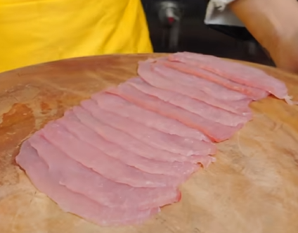
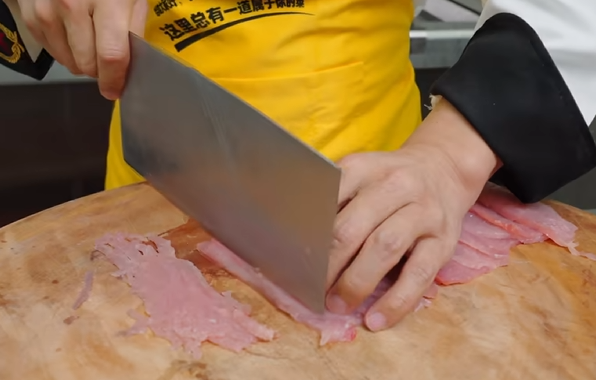
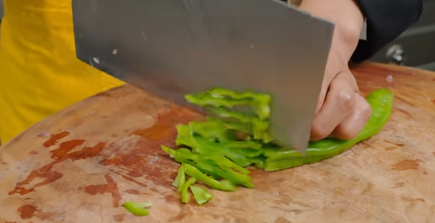

# 切肉丝

里脊肉哦，在家做的话，4两到半斤都是可以的嗷。

白膜咬不动片掉不要，肉丝在炒的烹饪情况下，在码味完之后会变大，所以我们切的时候要切小一点，所以切片的时候要切薄片，但是化开的肉根本不好切薄片，切就算能切，其刀口也一定不如冻住的肉整齐，所以我们直接用冻住的肉切薄片。

将切好的肉片铺平

切细长丝

泡水清洗，这段时间可以去切青椒，然后沥干水分，一定要挤干不然会粘锅（但是注意力度不要把肉丝掐断）。

# 切青椒

拿去跟肉丝 1：1 或者 4：6 的量

青椒去头去尾去籽，将辣椒一分为二叠在一起

斜切，要比肉丝稍微短一些才好看

# 腌制

- 先放一点点盐，算是底味；然后放一点点小苏打，为了让肉内部吸水更嫩；加入蛋清，半个就好，不能太多；用手轻轻搅和，均匀涂抹
- 加入一点点水淀粉（玉米淀粉，让肉更嫩）；用手左右横打搅拌（并非大力摔打）
- 加入一点点油（防止粘连在一起）；用手让其松散，每一根之间有油隔阂

# 炒

- 干锅烧热！烧冒烟！
- 少量油加入，烧热之后，滑锅然后倒出
- 少量冷油加入，然后直接加入肉，先不要动它，等它先定一下型，然后把它搅散，边搅散边受热，直到没有红色
- 加入葱姜蒜豆瓣酱（看你喜欢的调味），搅散
- 加入青椒，炒断生
- 调味，盐生抽糖胡椒粉看着放，水淀粉勾薄芡

# 总结

4两到半斤里脊肉；去白膜；冻肉切薄片；摆开切细长丝

