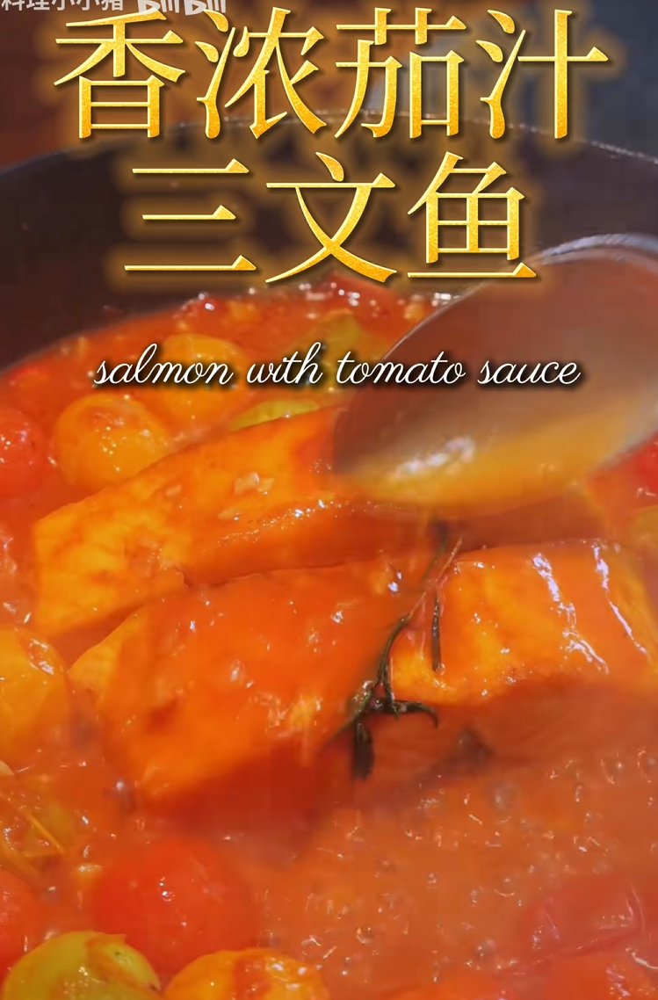

[三文鱼教程](https://www.bilibili.com/video/BV1MqMYz1EoY/?vd_source=386bdb94ff2a430f8d22a6de9755030c)

# 备菜

- 三文鱼：300g 这里的三文鱼最好块大一点，可以四面煎制
- 小番茄：150g
- 青柠：1/2
- 鸡蛋：1个

（番茄膏）

配料
- 洋葱心
- 小米辣
- 蒜

- 蜂蜜 5g
- 生抽 10g
- 水淀粉 5g

# 备料

- 将三文鱼加盐和一个蛋黄拌匀，然后均匀地裹上适量生粉

- 洋葱（小段）蒜（小块）小米辣（小段）切好（炒的料）

- 蜂蜜，生抽，水淀粉（倒的汁水）

# 起锅

三文鱼四面煎至定型，捞出

然后热料炒香

加入小番茄，炒到软烂出汁（再加入番茄膏浓郁关键）（注意这一步，其实小番茄没必要，就算加了也不要把它炒烂，作为配菜水果就好，这里主要还是借着番茄膏的味道比较好）

倒入少量清水，炖煮 30 秒。（甚至感觉可以不用煮，直接挂上汁料不就行了，反正如果三文鱼没有切小片的话还是不会怎么入味）

三文鱼回锅，挤入柠檬汁

美味酱汁，小火咕噜 2 分钟入味。

研磨少许黑胡椒。

