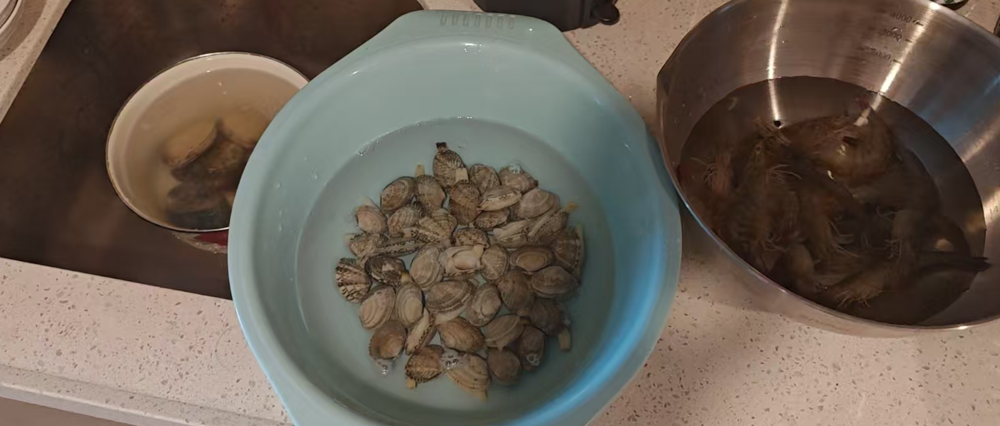
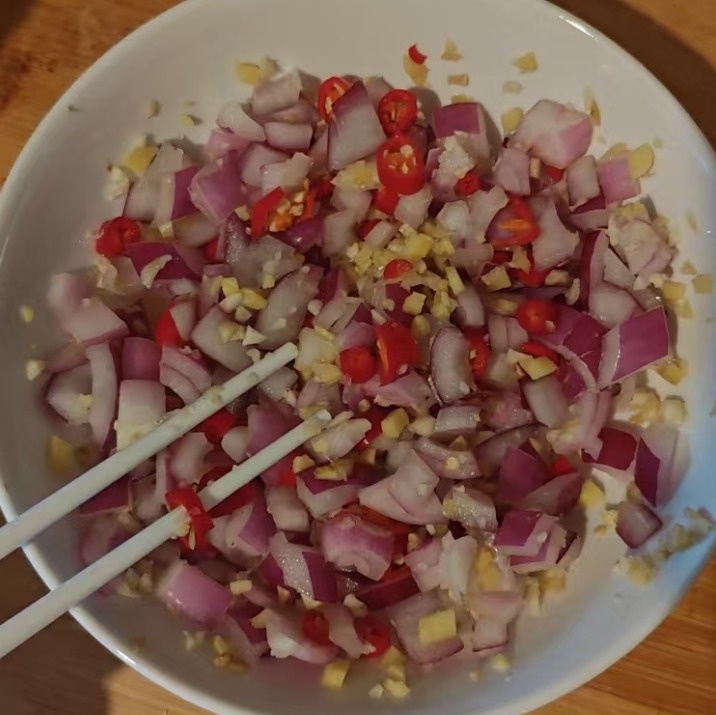
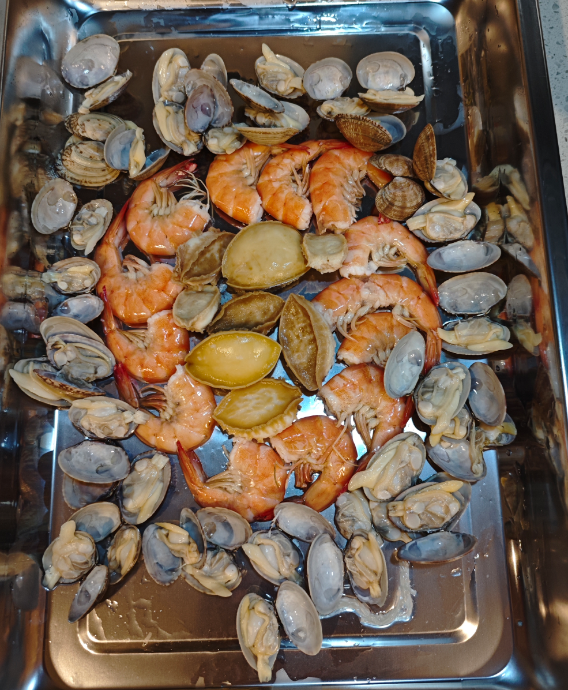

没有什么固定的搭配，喜欢吃什么，就从市场买回来什么。

有些人第一步先把海鲜焯水了，这可不对。

# 先做捞汁（两人份）

洋葱1/4切成碎丁，小米辣3根，切成碎丁，姜末10g，蒜末10g

然后加白砂糖15g。（渗透压功能）让刚刚的调料素材“出汗”。

切红椒块配色，香菜段提味道，小葱拍扁切小段，柠檬（2人用半个柠檬就好）切片去籽。 这些适量就好。少加，不要抢了料

然后放调味汁：耗油10g，鱼露10ml，生抽25ml，美极鲜15ml，花椒油15ml，香油10ml，芥末油5ml，水1瓶（180ml，这个不要太多会稀释的，我用的300太淡了不浓稠了）

最后加入适量辣椒油。

弄完这些就可以静置让食材释放其本身味道。

# 准备海鲜

## 海鲜焯水

水里加入大段葱姜，花雕酒 30 ml，盐 6g。

海鲜分批下锅，因为食材成熟时间不同，所以分开算时间去焯水。

注意这锅水适量焯，一般焯两种海鲜就应该重新换水。

鲍鱼三分钟。

